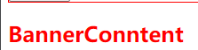

# React中的CSS

- `css` —直是 `React` 的痛点，在这一点上，`Vue` 的做法好于 `React`
  - `Vue` 通过在 `.vue` 文件中的<style> <style>标签来编写样式
  - 通过 `scoped` 属性来决定样式是全局还是局部有效
  - 通过 `lang` 属性来设置 `less`、`sass` 等预处理器
  - 通过内联样式来动态设置 `css`

- 相比而言，`React` 官方并没有给出在 `React` 中统一的样式风格
  - 从普通的 `css`，到 `css modules`，再到 `css in js`，有多种不同的解决方案，上百个不同的库
  - `React` 到目前为止也没有统一的 `CSS` 编写方案

# 内联样式

- 内联样式是官方推荐的一种 `css` 样式写法

  - `style` 采用小驼峰命名属性的 `JavaScript` 对象，而不是 `CSS` 字符串

  ```jsx
  <h2 style={{ color:'red', fontSize: '30px' }}>App标题</h2>
  ```

  - 并且可以引用 `state` 中的状态来设置相关的样式

  ```jsx
  <p style={{ fontSize: `${this.state.contentSize}px`}}>App内容</p>
  ```

- **内联样式的优点：**
  - 样式之间不会有冲突
  - 可以动态获取当前 `state` 中的状态
- **内联样式的缺点：**
  - 写法上都需要使用驼峰标识
  - 某些样式没有提示
  - 大量的样式代码混乱
  - 某些样式无法编写(如伪类/伪元素)

- 官方希望内联样式和普通的 `css` 来结合编写

# 普通的CSS

- 普通的 `css` 通常编写到一个单独的文件，之后进行引入，该方式和原生开发中编写方式是一致的
- **注意：**普通的 `css` 都属于全局的 `css`，样式之间会相互影响

```jsx
import { PureComponent } from 'react'
import './style.css'

class App extends PureComponent {
  render() {
    return (
      <div>
        <h2 className='title'>App标题</h2>
        <p className='content'>App内容</p>
      </div>
    )
  }
}
```

```css
/* style.css */
.title {
  color: red;
}

.content {
  font-size: 25px;
}
```

- **缺点：**这种编写方式最大的问题是样式之间会相互覆盖

# CSS Modules

- `css modules` 并不是 `React` 特有的解决方案，而是使用类似 `webpack` 配置的环境下都可使用
  - 需要自行配置，配置 `webpack.config,js` 中的 `modules: true`
- `React` 脚手架已经内置了 `css modules` 的配置
  - `.css`、`.less`、`.scss`等样式文件需要修改成 `.module.css`、`.module.less`、`.module.scss`

```jsx
import { PureComponent } from 'react'
import appStule from './App.module.css'

class App extends PureComponent {
  render() {
    return (
      <div>
        <h2 className={appStule.title}>App标题</h2>
        <p className={appStule.content}>App内容</p>
      </div>
    )
  }
}
```

```css
/* App.module.css */
.title {
  color: red;
}

.content {
  font-size: 25px;
}
```

- `css modules` **通过补充组件名和哈希值动态生成 `class`**，使其变得唯一，解决了局部作用域的问题


- `css modules` 方案的缺点：
  - 类名不能使用连接符(如 `.home-title`)，在 `JavaScript` 中是不识别的
  - 所有 `className` 必须使用 `{style.className}` 的形式来编写
  - 不方便动态修改样式，依然需要使用内联样式的方式

# CSS in JS(styled-components)

- **含义：** 一种模式，其中 `CSS` 由 `JavaScript` 生成，而不是在外部文件中定义
- **`CSS-in-JS` 模式：**一种将样式写到 `JavaScript` 中的方式，可以方便使用 `JavaScript` 的状态，该模式在 `React` 中编写 `CSS` 最受欢迎
- **作用：**通过 `JavaScript` 来为 `CSS` 赋予一些能力，包括类似于 `CSS` 预处理器一样的样式嵌套、函数定义、逻辑复用、动态修改状态等
- **注意：**此功能并不是 `React` 的一部分，而是由第三方库提供

- **styled-components**依然是社区最流行的 `CSS-in-JS` 库，其次还有**emotion**、**glamorous**

- 安装 `styled-components`

```shell
npm install styled-components@5
```

## styled的基本使用

- `styled-components` 的本质是通过函数的调用，最终创建出一个组件
- 这个组件会被自动添加上一个不重复的 `className`
- `styled-components` 会给该 `class` 添加相关的样式
- 支持类似于 `CSS` 预处理器一样的样式嵌套
  - 支持直接子代选择器或后代选择器，并且直接编写样式
  - 可以通过&符号获取当前元素
  - 直接伪类选择器、伪元素等

```javascript
// style.js
import styled from 'styled-components'

export const AppWrapper = styled.div`
  .section {
    border: 1px solid red;
    .title {
      color: blue;
      &:hover {
        background-color: purple;
      }
    }
    .content{
      font-size: 25px;
    }
  }

  .footer {
    border: 1px solid orange;
  }
`
```

- 在组件中引入并使用

```jsx
import { PureComponent } from 'react'
import { AppWrapper } from './style'

class App extends PureComponent {
  render() {
    return (
      <AppWrapper>
        <div className="section">
          <h2 className='title'>App标题</h2>
          <p className='content'>App内容</p>
        </div>
      
        <div className="footer">
          <p>底部声明</p>
        </div>
      </AppWrapper>
    )
  }
}
```


## props和attrs

- 通过 `props` 传递 `state` 中的数据，可以被传递给 `styled` 组件

```jsx
const { size, color } = this.state;

<SectionWrapper size={size} color={color}>
  <h2 className='title'>App标题</h2>
  <p className='content'>App内容</p>
  <button onClick={e => this.setState({ color: 'skyblue' })}>修改颜色</button>
</SectionWrapper>
```

- 获取 `props` 需要通过 `${}` 传入一个插值函数，`props` 会作为该函数的参数，可以用于动态编写样式

```javascript
export const SectionWrapper = styled.div`
  border: 1px solid red;
  .title {
    font-size: ${props => props.size}px;
    color: ${props => props.color};
    &:hover {
      background-color: purple;
    }
  }
  .content{
    font-size: 25px;
  }
`
```

- 当外部没传入对应的 `props` 时，使用 `attrs()` 生成默认值

```javascript
export const SectionWrapper = styled.div.attrs(props => ({
    color: props.color || 'blue'
  })
)`
...样式编写
`
```

## styled高级特性

- `styled` 是可以支持样式的继承的

```javascript
// 定义基础样式
const MyButton = styled.button`
  padding: 8px 30px;
  border-radius: 5px;
  border: none;
`

// 样式继承自MyButton
export const WarnButton = styled(MyButton)`
  background-color: red;
  color: #fff;
`
```

```jsx
import { WarnButton } from './style';
<WarnButton>警告</WarnButton>
```


- 使用 `ThemeProvider` 共享样式数据

```jsx
// 使用ThemeProvider共享数据
import { ThemeProvider } from 'styled-components';

<ThemeProvider theme={{ color: 'red' }}>
  <Home/>
</ThemeProvider>
```

```javascript
// 在home组件的style.js文件中使用
import styled from 'styled-components'

export const HomeWrapper = styled.div`
  .banner {
    color: ${props => props.theme.color};
  }
`
```

```JSX
// 在Home组件中使用
import { HomeWrapper } from './style';
<HomeWrapper>
  <h2 className="banner">BannerConntent</h2>
</HomeWrapper>
```



# classnames库

- 当需要编写很多动态添加的 `class` 时，在 `className` 中使用过多的三元运算符会显得代码很繁琐
- 这时可以借助第三方库 `classnames`，用于动态添加 `className`
- 安装 `classnames`

```shell
npm i classnames
```

- 基本使用

```jsx
import classNames from 'classnames';

<div>
  <h2 className={classNames('aaa', { bbb: true, ccc: false })}>App标题</h2>
</div>
```


- 其他用法

```javascript
// 传入字符串
classNames('foo', 'bar'); // => 'foo bar'

// 传入对象
classNames('foo', { bar: true }); // => 'foo bar'

// 传入多个对象
classNames({ foo: true }, { bar: true }); // => 'foo bar'

// 传入多属性的单个对象
classNames({ foo: true, bar: true }); // => 'foo bar'

// 会忽略的值
classNames(null, false, 'bar', undefined, 0, 1, { baz: null }, ''); // => 'bar 1'

// 传入数组
classNames('a', ['b', { c: true, d: false }]); // => 'a b c'

// 使用动态属性名
classNames({ [`btn-${buttonType}`]: true });
```