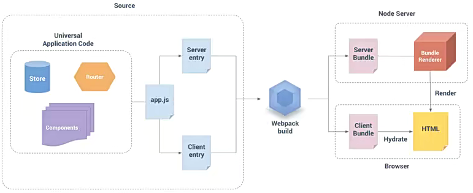

# 为什么需要Hook

- `Hook` 是 `React16.8` 的新增特性，可在不编写 `class` 组件的情况下，使用 `state` 以及其他 `React` 特性

> **`class` 组件相对于函数式组件的优势：**

- **从状态维护角度来说：**
  - `class` 组件可以定义 `state`，用于保存内部状态
  - 函数式组件不能维护自身状态，因为函数每次调用都会重新赋值初始状态
- **从使用`React` 特性来说：**
  - `class` 组件有生命周期，可在对应的生命周期中完成逻辑(如网络请求)
  - 函数式组件没有生命周期，如果在发送请求，意味着每次重新渲染都会发送
- **从渲染行为来说：**
  - `class` 组件在状态改变时只会重新执行 `render` 函数
  - 函数式组件在重新渲染时会执行整个函数

> **`class` 组件存在的问题：**

- **组件复杂度：**随着业务增多，`class` 组件会变得复杂，逻辑混在一起，强行拆分反而会造成过度设计，增加代码的复杂度
- **`this` 指向：**在 `class` 组件中必须搞清楚 `this` 的指向到底是谁，处理起来会比较麻烦
- **状态复用：**为了状态复用通常需要高阶组件，但类似于 `Provider`、`Consumer` 这些共享状态，会使得代码嵌套层次越来越复杂

#  Hook的概念

- `Hook` 的出现，是为了解决 `class` 组件存在的种种缺陷
- 使用 `Hook` 可以在不编写 `class` 的情况下使用 `state` 以及其他 `React` 特性，还能延伸出非常多的用法

> **`Hook` 的使用场景：**

- `Hook` 的出现基本可以代替所有使用 `class` 组件的地方
- 旧项目并不需要直接将代码重构为 `Hooks` ，因为它向下兼容，可以渐进式地使用 `Hook` 
- `Hook` 在函数组件中使用，用于增强函数组件的特性，并且简化代码

> **`Hook` 的本质：**

- `Hook` 就是 `JavaScript` 函数，该函数可以钩入(hook into)`React State` 以及生命周期等特性

> **`Hook` 使用规则：**

- 只能在函数最外层使用，不能在循环、条件判断或子函数中调用
- 只能在 `React` 的函数组件中使用，不能在其他 `JavaScript` 函数中调用
- 可以在自定义 `Hook` 中使用，`Hook` 函数必须以 `use` 开头

# 类组件与Hook对比


- 函数式组件结合 `Hooks` 让代码变得非常简洁，并且不用考虑 `this` 相关问题

# useState

- `useState` 会定义一个 `state` 变量，与 `class` 组件中的 `this.state` 提供的功能完全相同

> **`useState` 的参数和返回值：**

- **接收唯一参数：**作为组件第一次被调用时的初始化值，如果不传递则为 `undefined`
- **返回值：**包含两个元素的数组，分别为<font color='#61dafb'>**当前状态的值**</font>和<font color='#61dafb'>**设置状态值的函数**</font>

```javascript
import { useState } from 'react';
const [ message, setMessage ] = useState('Hello React')
```

> **为什么叫 `useState`，而不是 `createState`?**

- “create”可能不是很准确，因为 `state` **只在组件首次渲染的时候被创建**，在下一次重新渲染时，`useState` 返回的是当前的 `state`
- 这也是 `Hook` 的名字总是以 `use` 开头的一个原因

# useEffect

- 使用 `Effect Hook` 可以完成类似于 `class` 组件中生命周期的功能
- 类似于网络请求、手动更新 `DOM` 、事件监听等，都是 `React` 更新 `DOM` 的副作用(Side Effects)
- 通过 `useEffect` 的 `Hook`，可以通知 `React` 需要在渲染后执行某些操作

> **`useEffect` 基本使用**

- `useEffect` 要求传入一个回调函数，在 `React` 执行完更新DOM操作之后，就会执行该回调函数
- 默认情况下，无论是第一次渲染后还是每次更新后，都会执行这个回调函数

```javascript
import { useEffect } from 'react';
useEffect(() => {
  // 该回调函数会在组件渲染完成后自动执行
  // 更新后需要的操作
});
```

## 清除机制

- 在 `class` 组件中的某些副作用的代码，需要在 `componentWillUnmount` 中进行清除，如事件总线、Redux中手动订阅 `state` 变化，都需要取消对应的订阅
- `useEffect` 传入的回调函数A本身可以有一个返回值，这个返回值可以是另外一个回调函数B

```javascript
useEffect(function A(){
  console.log('监听redux中数据变化');
	return function B(){
    console.log('取消监听redux中数据变化');
  }
});
```

> **为什么要在 `effect` 中返回一个函数？**

- 这是 `effect` 可选的清除机制，**每个 `effect` 都可以返回一个清除函数**
- 这样做可以将添加和移除订阅的逻辑放在一起，提高代码的内聚性

> **`React` 清除 `effect` 时机**

- `React` 会在组件更新和卸载时执行清除操作

## 性能优化

- 默认情况下，`useEffect` 的回调函数会在每次渲染时都重新执行

> **回调多次执行导致的问题：**

- 某些代码只希望执行一次即可，类似于 `componentDidMount` 和 `componentWillUnmount` 中完成的事情(如网络请求、订阅和取消订阅)
- 多次执行也会导致一定的性能问题

> **`useEffect` 的第二个参数**

- 可以使用 `useEffect` 的第二个参数，用于决定何时应该执行回调函数
  - **参数一：**执行的回调函数
  - **参数二：**数组，用于决定哪些 `state` 变化时才重新执行回调

```javascript
useEffect(() => {
  console.log(counter);
}, [counter]); // 这里的effect只受counter影响，其他状态改变均不执行
```

- 如果**不希望依赖任何的内容时也可以传入一个空的数组**

```javascript
useEffect(() => {
  // 此时这里只有第一次渲染时执行，相当于componentDidMounted
  console.log('监听redux中数据变化');
	return () => {
    // 此时这里只会在组件被卸载时执行一次，相当于componentWillUnmount
    console.log('取消监听redux中数据变化');
  }
}, []);// 不受任何状态影响
```

## 逻辑分离

- 使用 `Hook` 的目的之一就是解决 `class` 组件中生命周期过多逻辑放在一起的问题
- 一个函数组件中可使用多个 `useEffect`，可将不同的 `effect` 分离到不同的 `useEffect` 中

```javascript
const App = memo(() => {
  useEffect(() => {
    // 发送网络请求...
  })

  useEffect(() => {
    // 监听redux数据变化
    return () => {
      // 取消监听
    }
  })
  //...
})
```

- `React` 会按照 `effect` 声明的顺序依次执行组件中的每一个 `effect`

# useContext

- 类组件可以通过静态属性 `contextType = MyContext` 方式，在类中获取 `context`
- 函数式组件可以通过 `MyContext.Consumer` 方式共享 `context`
- `Context Hook` 允许直接获取某个 `Context` 的数据

```javascript
import { useContext } from 'react';
import { UserContext, ThemeContext } from './context';

const userInfo = useContext(UserContext); // 获取Provider提供的数据
const themeInfo = useContext(ThemeContext);
```

- 当组件上层最近的<Provider>更新时，该 `Hook` 会触发重新渲染，并使用最新的 `value` 值

# useReducer

- `useReducer` 仅仅是 `useState` 的一种替代方案
  - 当 `state` 的逻辑比较复杂时，可以通过 `useReducer` 来进行拆分
  - 当本次修改的 `state` 需要依赖之前的 `state` 时，也可以使用

```jsx
import { memo, useReducer } from 'react';

const reducer = (state, action) => {
  switch(action.type) {
    case 'increment':
      return {...state, count: state.count + action.count};
    case 'decrement':
      return {...state, count: state.count - action.count};
    default:
      return state;
  }
}

const App = memo(() => {
  const [ state, dispacth ] = useReducer(reducer, { count: 0 })

  return (
    <div>
      <h2>当前计数：{state.count}</h2>
      <button onClick={e => dispacth({ type:'increment', count: 1 })}>+1</button>
      <button onClick={e => dispacth({ type:'decrement', count: 1 })}>-1</button>
      <button onClick={e => dispacth({ type:'increment', count: 5 })}>+5</button>
      <button onClick={e => dispacth({ type:'decrement', count: 5 })}>-5</button>
    </div>
  )
})
```

# useCallback

- 使用 `useCallback` 实际的目的是为了进行性能的优化

> **如何进行性能优化？**

- 当函数式组件中的状态发生变化时，整个函数会重新执行，如果在内部有定义函数，那么每次重新执行都会重新定义新函数并重新赋值
- `useCallback` 会返回一个 `memoized`(记忆的)回调函数，当函数被多次定义时，在依赖不变的情况下返回的函数是相同的

> **性能优化的点：**

- 当将函数传递给子组件时，若父组件中状态变化则会重新渲染，传递到子组件的函数也会重新定义，这样就会引起子组件中 `props` 变化，导致子组件也会重新渲染

```jsx
import { memo, useCallback, useState } from 'react';

// 子组件
const Increment = memo((props) => {
  // props中属性发生变化会引起组件重新渲染
  console.log('被渲染');
  return <button onClick={props.increment}>increment + 1</button>
})

const App = memo(() => {
  const [ counter, setCounter ] = useState(0);
  const [ message, setMessage ] = useState('Hello');
	// 这里只依赖counter，只有当counter发生变化时，increment的值才会发生变化
  // 而当message发生变化时，increment不受影响，则不会导致子组件重新渲染
  const increment = useCallback(() => setCounter(counter + 1), [counter])

  return (
    <div>
      <h2>当前计数：{counter}</h2>
      <Increment increment={increment}/>
      <hr />
      <h2>Message:{message}</h2>
      <button onClick={e => setMessage(Math.random())}>修改Message</button>
    </div>
  )
})
```

- 当父组件内 `useCallback` 依赖的状态变化时，`useCallback` 的返回值也会变化，子组件还是会重新渲染

- 基于这点可以做进一步性能优化，让 `useCallback` 内的函数不依赖任何状态

  - **注意：**假如不依赖任何状态，那么 `useCallback` 返回的函数是不变的，这样就会**造成闭包陷阱**

  ```javascript
  // 闭包陷阱
  const MyUseCallback = (count) => { 
    return () => {
      const newCount = count + 1
      console.log(newCount);
    }
  }
  
  const MyIncrement1 = MyUseCallback(0)
  MyIncrement1() // 1
  
  const MyIncrement2 = MyUseCallback(1)
  MyIncrement2() // 2
  
  MyIncrement1() // 1   由于MyIncrement1的依赖在声明时已经确定为0，不会改变
  ```

  - 那么`useCallback` 的返回值不变的话，依赖的依然是初始化时的状态

  ```javascript
  const [ counter, setCounter ] = useState(0);
  // 由于useCallback返回的值相同，下面的counter永远是0
  const increment = useCallback(() => setCounter(counter + 1), [])
  // 这些相当于一直调用setCounter(1)
  ```

- 可以结合 `ref` 引用做进一步性能优化

```javascript
import { useCallback, useState, useRef } from 'react';

const counterRef = useRef();
counterRef.current = counter;
const increment = useCallback(() => setCounter(counterRef.current + 1), []);
```

> **使用 `useCallback` 的目的**

- 通常使用 `useCallback` 的目的是不希望子组件进行多次渲染，并不是为了函数进行缓存

# useMemo

- `useMemo` 实际目的也是为了进行性能的优化

> **如何进行性能优化？**

- `useMemo` 返回值也是 `memoized` (记忆的)值，在依赖不变的情况下，返回的值是相同的

```javascript
const cachedValue = useMemo(calcVal, dependencies);
```

> **性能优化的点：**

- 在组件内进行大量计算操作，在组件重新渲染时都会重新计算一次，可以使用 `useMemo` 避免这种频繁计算

```jsx
import { memo, useMemo, useState } from 'react';

// 计算1+2+...+total的总和
const calcSum = (total) => {
  const totalNums = Array.from({ length: total },(_, i) => i + 1);
  return totalNums.reduce((preValue, curValue) => preValue + curValue, 0);
}

const App = memo(() => {
  const [ count, setCount ] = useState(0);
  // 下面每次点击按钮改变count都会计算一次calcSum(500)赋值给result
  const result = calcSum(500); 
  // 下面只会在第一次渲染时才会计算一次，后续状态改变则不会重新执行
  const totalResult = useMemo(() => calcSum(500), [])
  return (
    <div>
      <h2>count:{totalResult}</h2>
      <h2>计数器:{count}</h2>
      <button onClick={e => setCount(count + 1)}>+1</button>
    </div>
  )
})
```

- 对子组件传递相同内容的对象时，当父组件状态改变时会重新渲染，给子组件传递的对象会重新赋值，造成子组件也会重新渲染，可以使用 `useMemo` 进行性能的优化

```jsx
const App = memo(() => {
  // 这种写法，App组件状态变化时，info会被重新赋值，造成子组件也会重新被渲染
  const info = { name:'Jimmy', age: 33 };
  // 使用useMemo优化
  const info = useMemo(() => ({ name:'Jimmy', age: 33 }), []);
  return <Child info={info}/>
})
```

> **与 `useCallback` 的区别**

- `useCallback` 返回的是函数，`useMeno` 返回的是值

```javascript
// 下面的写法是等价的

useMemo(() => fn, []);

useCallback(fn, []);
```

# useRef

- `useRef` 返回一个 `ref` 对象，返回的 `ref` 对象在组件的整个生命周期保持不变

> **`ref` 的两种常用用法：**

- ①引入 `DOM` 或 组件元素

```jsx
import { useRef } from 'react';

const titleRef = useRef();

<h2 ref={titleRef}>Hello World</h2>
```

- ②保存一个数据，解决闭包陷阱

```JSX
import { memo, useRef, useState, useCallback } from 'react';

const App = memo(() => {
  const [ count, setCount ] = useState(0);
  
  const countRef = useRef();
  countRef.count = count;
  const changeCount = useCallback(() => setCount(countRef.count + 1), [])

  return (
    <div>
      <h2 ref={countRef}>{count}</h2>
      <button onClick={changeCount}>修改count</button>
    </div>
  )
})
```

# uselmperativeHandle

- 当将子组件的 `DOM` 暴露给父组件时，可能会引发不可控的情况，因为父组件拿到 `DOM` 后可进行任意操作
- 可以通过 `uselmperativeHandle` 暴露固定的 `DOM` 操作，将传入的 `ref` 和 `uselmperativeHandle` 第二个参数返回的对象绑定到一起，在父组件中操作的 `DOM` 实际上是返回的对象

```jsx
import { memo, forwardRef, useRef, useImperativeHandle } from 'react';

const MyInput = memo(forwardRef((props, ref) => {
  const inputRef = useRef();
  // 对父组件传入的ref进行处理
  useImperativeHandle(ref, () => ({
    // 只暴露focus操作
    focus() {
      inputRef.current.focus()
    }
  }))
  return <input type="text" ref={inputRef}/>
}));

const App = memo(() => {
  const inputRef = useRef();
  const handleDOM = () => {
    // 父组件中操作子组件的inputRef时，只能使用focus()
    inputRef.current.focus();
  }

  return (
    <div>
      <MyInput ref={inputRef}/>
      <button onClick={handleDOM}>操作DOM</button>
    </div>
  )
})
```

# useLayoutEffect

- `useLayoutEffect` 看起来和 `useEffect` 非常相似，事实上也只有一点区别：
  - `useEffect` 会在渲染内容更新到 `DOM` 上后执行，不阻塞 `DOM` 的更新
  - `useLayoutEffect` 会在渲染内容更新到 `DOM` 上前执行，会阻塞 `DOM` 的更新

- 如果希望在某些操作之后再更新 `DOM`，可以将该操作放到 `useLayoutEffect` 中


```jsx
const App = memo(() => {
  useEffect(() => {
    console.log('useEffect'); // 3
  })

  useLayoutEffect(() => {
    console.log('useLayoutEffect'); // 2
  })

  console.log('App render'); // 1

  return <div>App</div>
})
```

# useTransition

- **官方解释：**返回一个状态值表示过渡任务的等待状态，以及一个启动该过渡任务的函数
- 实际上就是通知 `react` 对于某部分任务的更新优先级较低，可以稍后进行更新

> **`useTransition` 使用场景**

- 当数据量非常庞大时，如果按照用户的输入进行数据过虑的话，会造成用户输入时有延迟现象
- 使用 `useTransition` 可以做到，待用户输入完成后再进行数据过滤，保证用户的体验
- 并且当数据过滤的结果完成之前，还可以给用户作出提示，待过滤完成后再展示

```jsx
import { memo, useState, useTransition } from 'react';
// namesArray是有一万条数据的数组
import namesArray from './namesArray';

const App = memo(() => {
  const [ showNames, setShowNames ] = useState(namesArray);
  const [ pending, setTransition ] = useTransition();

  // 监听用户输入事件
  const handleValueChange = (e) => {
    // 把数据过滤的操作延迟至用户输入完成后执行，不影响用户的输入体验
    setTransition(() => {
      const filterShowNames = namesArray.filter(item => item.includes(e.target.value));
      setShowNames(filterShowNames)
    })
  }

  return (
    <div>
      <input type="text" onInput={handleValueChange}/>
      {/* pending是表示未完成状态，当数据未完成过滤时，可以先展示loading */}
      <h2>用户名列表: {pending && <span>loading...</span>}</h2>
      <ul>
        {
          showNames.map((item, i) => <li key={i}>{item}</li>)
        }
      </ul>
    </div>
  )
})
```

> **`useTransition` 返回值**

- **返回值一 `pending`：**布尔值，表示延迟的操作是否已经完成
- **返回值二 `setTransition`：**函数，接收一个回调函数作为参数，回调函数内是需要延迟的逻辑操作

# useDeferredValue

- **官方解释：**`useDeferredValue` 接受一个值，并返回该值的新副本，该副本将推迟到更紧急地更新之后
- 实际上 `useDeferredValue` 的作用是一样的效果，可以让更新延迟

```javascript
import { useDeferredValue } from 'react';
// namesArray是有一万条数据的数组
import namesArray from './namesArray';

const deferredshowNames = useDeferredValue(showNames);
```

- 使用 `useDeferredValue` 返回的副本数据，会让界面延迟渲染

# useId

- `useld` 是一个**用于生成横跨服务端和客户端的稳定的唯一 `ID`** 的同时**避免 `hydration` 不匹配**的 `hook`
  - **注意：**`hydration` 是与服务端渲染(SSR)概念相关的

> **何为 `SSR`？**

- SSR(Server Side Rendering，服务端渲染)，指的是页面在服务器端已经生成了完整的 `HTML` 页面结构，不需要浏览器解析
- 与之对应的是CSR(Client Side Rendering，客户端渲染)，例如 `SPA` 页面就是依赖客户端渲染

> **`SPA` 最核心的两大缺陷：**

- **不利于 `SEO`(Search Engine Optimization)**
  - 像百度、谷歌搜索引擎等都会爬取每个网站的 `index.html`，从而获取里面的关键信息收录到数据库中
  - 当在百度使用关键字搜索时，就会根据关键字去数据库里匹配信息，根据信息匹配度来决定网站排名
  - 由于 `SPA` 页面的 `index.html` 除了 `meta` 配置，就剩下<body>中的<div id='root'>，无法爬取更多与网站相关的信息
  - 那么该网站的排名就会非常靠后，获取不到用户的浏览量，导致无法转化成对应的销量
- **首屏渲染速度**
  - 早期的 `SSR` 页面是在服务端就把 `HTML` 完成解析了，在访问时是把整个网页请求下来渲染即可，不需要通过浏览器进行解析
  - 现在的 `SPA` 页面只是将 `index.html` 请求下来，在遇到<script src='xxx.js'>标签时，又会去服务器将对应的 `js` 文件请求下来，交给浏览器解析并执行一遍
  - 假如 `SPA` 页面没有路由懒加载，分包，图片压缩等技术，那么 `JS` 的解析和执行就会造成渲染的阻塞，导致首屏渲染速度非常慢

> **理解 `SSR` 同构应用**

- 一套代码既可以在服务端运行，又可以在客户端运行，这就是同构应用
- 同构是一种 `SSR` 的形态，是现代 `SSR` 的一种表现形式

> **`Hydration` 的由来**

- 当用户访问网站发出请求时，先在服务器通过 `SSR` 渲染出首页的内容，但由于服务端是没有类似 `document API` 的东西，此时渲染的内容只作展示，无任何交互
- 对应的代码需要在客户端被执行一遍，目的就是向该网页注入交互性的内容，而这个过程就叫 `hydrate`



> **何为 `Hydration`？**

- 在进行 `SSR` 时，页面会呈现为 `HTML`，但不足以使页面具有交互性，浏览器端 `JavaScript` 为零的页面不能是交互式的(没有 `JavaScript` 事件处理程序来响应用户操作)
- 为了使页面具有交互性，除了在 `Node.js` 中将页面呈现为 `HTML` 外，`UI` 框架(如Vue/React等)还在浏览器中加载和呈现页面，注入对应的交互性（它创建页面的内部表示，然后将内部表示映射到在 `Node.js` 中呈现的 `HTML` 的 `DOM` 元素）
- 这个过程就称为 `Hydration`，它使得我们的页面是交互式的


> **`useId` 的应用**

- `useld` 用于 `react` 的同构应用开发，前端的 `SPA` 页面并不需要
- `useld` 可以保证应用程序在客户端和服务端生成唯一的 `ID`，有效避免通过其他手段生成不一致的 `id` ，造成 `hydration mismatch`

```jsx
import { useId } from 'react';
const uid = useId(); // 这个id是不会变化的

<label htmlFor={id}>
	<input id={id} type='text'/>
</label>
```

# 自定义Hook

- 自定义 `Hook` 本质上是一种函数代码逻辑的抽取，严格意义上来说并不算 `React` 的特性
- 自定义 `Hook` 函数的名称必须以 `use` 开头

- **需求①：**所有的组件在创建和销毁时都进行打印

```jsx
const useLogComponentLife = (componentName) => {
  useEffect(() => {
    console.log(`${componentName}组件被创建`);
    return () => console.log(`${componentName}组件被销毁`);
  },[])
}

const Home = memo(() => {
  useLogComponentLife('Home')
  return <h1>Home Component</h1>
})

const App = memo(() => {
  const [isShow, setIsShow] = useState(true)
  useLogComponentLife('App')
  return (
    <div>
      <h1>App Component</h1>
      <button onClick={e => setIsShow(!isShow)}>切换</button>
      {isShow && <Home/>}
    </div>
  )
})
```

- **需求②：**使用自定义 `Hook` 共享 `Context` 数据

```jsx
import { useContext } from 'react';
import { UserContext, TokenContext } from '../context';

const useUserToken = () => {
  const user = useContext(UserContext);
  const token = useContext(TokenContext);
  return [ user, token ]
}

const App = memo(() => {
  const [ user, token ] = useUserToken();
  return <h1>App: {user.name}-{token}</h1>
})
```

- **需求③：**获取滚动位置

```jsx
import { memo, useEffect, useState } from 'react';

const useScrollPosition = () => {
  const [positionX, setPositionX ] = useState(0);
  const [positionY, setPositionY ] = useState(0);

  useEffect(() => {
    const handleScroll = () => {
      setPositionX(window.scrollX);
      setPositionY(window.scrollY);
    };
    
    window.addEventListener('scroll', handleScroll);
    
    return () => {
      window.removeEventListener('scroll',handleScroll);
    };
  }, []);

  return [ positionX, positionY ];
}

const App = memo(() => {
  const [ scrollX, scrollY ]  = useScrollPosition();
  return (
    <div className='app'>
      <h1>App x: {scrollX}</h1>
      <h1>App y: {scrollY}</h1>
    </div>
  )
})
```

# Redux Hooks

- 在旧版本的 `React` 中，为了让组件和 `redux` 结合起来，使用了 `react-redux` 中的 `connect`
  - 该方式必须使用高阶函数结合返回的高阶组件
  - 必须编写映射：`mapStateToProps` 和 `mapActionToProps` 映射的函数
- 从 `Redux7.1` 开始，可以使用 `Hook` 的方式完成 `redux` 与组件的结合

## useSelector

- `useSelect` 的作用是将 `state` 映射到组件中

> **参数与返回值**

- **参数一：**立即执行的回调函数，该回调函数返回一个对象，包含需要映射的数据
- **参数二：**`shallowEqual`函数(`react-redux` 库提供)，用于决定是否让组件重新渲染
- **返回值：**映射的数据

> **`shallowEqual` 的作用：**

- 由于组件内使用了 `useSelector` 映射 `state` 的数据，那就会监听 `state` 的数据是否发生变化
- 当有子组件映射了 `state` 中的数据 `A` 时，若父组件中修改 `state` 中的数据 `B`，会造成子组件重新渲染
- 由于使用 `memo` 包裹的组件，只有 `props` 发生变化时才会重新渲染，不使用 `shallowEqual` 作浅层比较的话，`memo` 的存在就显得没有意义了，造成代码性能会很低
- 使用 `shallowEqual` 是**为了比较从映射 `state` 的数据是否发生改变**，若改变再重新渲染组件

```jsx
import { useSelector, shallowEqual } from 'react-redux';

const Home = memo((props) => {
  const { message } = useSelector((state) => ({
    message: state.counter.message,
  }), shallowEqual)
  
  return <h2>Home Message: {message}</h2>
})

const App = memo(() => {
  const { num } = useSelector((state) => ({
    num: state.counter.num,
  }), shallowEqual)
  
  return (
  	<div>
    	<h2>App Num: {num}</h2>
      <Home/>
    </div>
  )
})

// 上面代码中，当App组件内的num被修改时，会引起Home组件重新渲染
// 当Home组件内的message被修改时，也会引起App组件重新渲染
```

## useDispatch

- **作用：**直接获取 `dispatch` 函数，直接在组件中使用

```jsx
import { useDispatch } from 'react-redux';
import { addNumberAction } from './store/modules/counter';

const dispatch = useDispatch();

<div>
  <h2>App Num: {num}</h2>
  <button onClick={e => dispatch(addNumberAction(5))}>+5</button>
</div>
```

## useStore

- 直接获取整个 `store` 对象，但在开发中不建议直接操作 `store` 

```javascript
import { useStore } from 'react-redux';

const store = useStore();
```