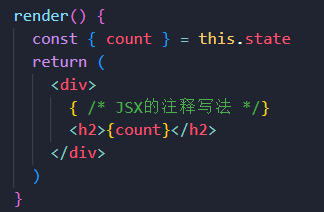
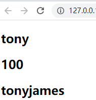
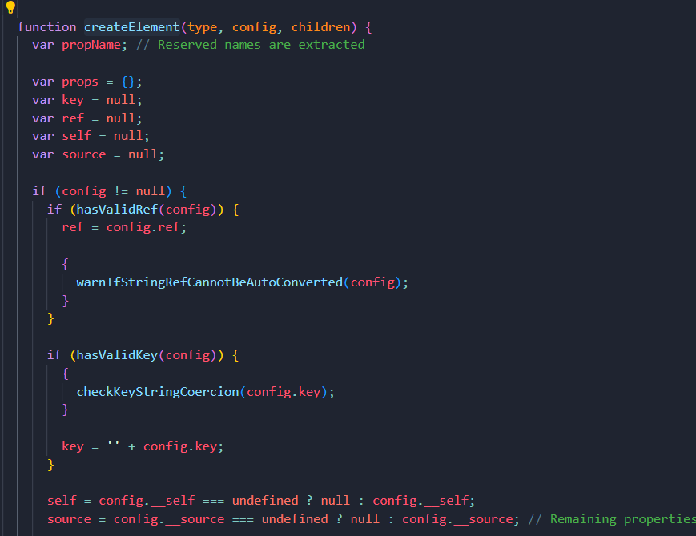
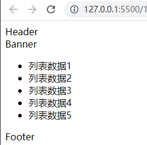
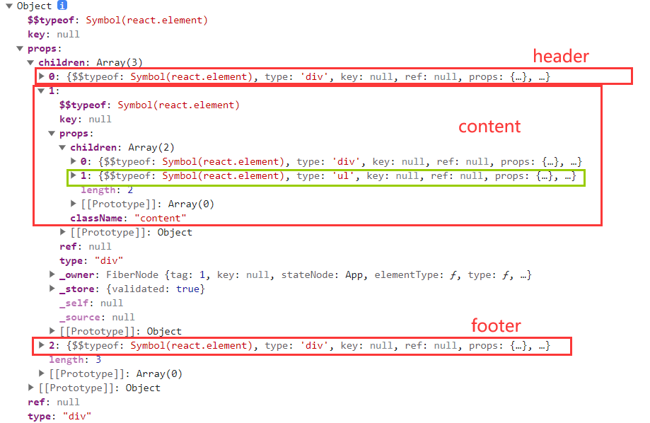

# JSX简介

```jsx
let element = <h1>Hello，React</h1>
```

- 右侧赋值的标签并不是字符串，而是一段 `JSX` 的语法

> **`JSX` 是什么？**

- `JSX` 是一种 `JavaScript` 的语法扩展，也称之为 `JavaScript XML`，因为看起来就是一段 `XML` 语法
- `JSX` 用于描述 `UI` 界面，并且其完成可以和 `JavaScript` 融合在一起使用
- `JSX` 不同于 `Vue` 中的模块语法，不需要专门学习模块语法中的一些指令(如 `v-for`、`v-if` 等)

> **为什么 `React` 选择了 `JSX`？**

- `React` 认为渲染逻辑本质上与其他 `UI` 逻辑存在内在耦合
  - 如 `UI` 需要绑定事件(`button`、`a` 原生等等)
  - 如 `UI` 中需要展示数据状态
  - 如在某些状态发生改变时，又需要改变 `Ul`
- 由于他们之间密不可分，所以 `React` 没有将标记分离到不同的文件中，而是将它们组合到了一起，这个地方就是组件

> **`JSX` 书写规范：**

- `JSX` 的顶层只能有一个根元素，很多时候会在外层包裹一个 `<div>` 元素(或 `<Fragment>` )
- 通常在 `JSX` 外层包裹一个小括号`()`，这样可以方便阅读，并且 `JSX` 可以进行换行书写
- `JSX` 中的标签可以是单标签(以 `/>` 结尾)，也可以是双标签

# 基本使用

- `JSX` 的注释编写

```jsx
{ /* JSX的注释写法 */}
```



- `JSX` 插入内容

```jsx
<h2>{变量}</h2>
```

- 当变量是 `Number`、`String`、`Array` 类型时，可以直接显示

```jsx
<h2>{'tony'}</h2>
<h2>{100}</h2>
<h2>{['tony', 'james']}</h2> { /* 数组会将元素拼接 */}
```



- 当变量是 `null`、`undefined`、`Boolean`类型时内容为空，如果希望可以显示 `null`、`undefined`、`Boolean`，则需要转成字符串

```jsx
<h2>{null}</h2>
<h2>{undefined}</h2>
<h2>{true}</h2>
```

- 可以直接插入表达式，如运算表达式，三元运算等

```jsx
<h2>{10 + 20 + 30}</h2>

<h2>{a > 1 ? 1 : a}</h2>
```

> **注意：**对象类型不能作为渲染内容(`not valid as a React child`)

# 绑定属性

- 有些元素需要绑定 `title`、`src`、`href` 属性，也是使用 `{}` 绑定

```jsx
{/* 静态绑定 */}
<h2 title="Hello React">Hello React</h2>

<a href="www.baidu.com"></a>

{/* 动态绑定,使用变量 */}
<h2 title={titleText}>Hello React</h2>

<a href={jumpLink}></a>
```

- 绑定 `class` 样式类属性

> **注意：**绑定样式不可使用 `class = '类名'`，`babel` 会将 `jsx` 的 `class` 解析成类，需使用 `className`

```jsx
{/* 静态绑定 */}
<h2 className="title">Hello React</h2>

{/* 使用数组静态绑定,须使用join拼接，否则会用逗号分隔 */}
<h2 className={['title', 'ml-5'].join(" ")}>Hello React</h2>

{/* 动态绑定 */}
<h2 className={isActive ? 'active' : ''}>Hello React</h2>

{/* 混合绑定 */}
<h2 className={`title ${isActive ? 'active' : ''}`}>Hello React</h2>
```

- 绑定 `style` 样式属性，需要使用对象类型

```jsx
<h2 style={{ color: 'red', fontSize: '36px' }}>Hello React</h2>
```

# 事件绑定

- `React` 事件的命名采用小驼峰式(`camelCase`)，而不是纯小写
- 需要通过 `{}` 传入一个事件处理函数，这个函数会在事件发生时被执行

```jsx
<h2 onClick={函数名}>Hello React</h2>
```

- 在事件执行后，需要用到 `this` 获取当前类的对象中相关的属性，但此时 `this` 为 `undefined`

```jsx
<button onClick={this.handleCountAdd}>加1</button>
```

```javascript
handleCountAdd() {
	console.log(this) // undefined
}
```

### this绑定问题

> **为什么 `this` 是 `undefined`?**
>
> - 这里并非隐式绑定 `this`，而是直接把函数的地址传给 `button`，通过 `babel` 解析成以下内容
>
> ```javascript
> React.createElement('button', { onClick: this.handleCountAdd })
> ```
>
> - 当点击按钮时会独立调用该函数，在 `babel` 的解析下，`this` 会指向 `undefined`

- 因此需要显示对函数绑定 `this` 为当前实例

```javascript
class App extends React.Component {
  constructor() {
    super()
    this.handleCountAdd = this.handleCountAdd.bind(this)
  }
  ...
  
  handleCountAdd() {
		console.log(this) // APP
	}
}
```

- 或者把函数改为箭头函数形式

```javascript
const handleCountAdd = () => {
  this.setState({
    count: ++this.state.count
  })
}
```

- 还可以在 `JSX` 里直接使用箭头函数，形成隐式绑定 `this`

```jsx
<button onClick={() => this.handleCountAdd()}>加1</button>
```

### 参数传递

- 在事件绑定时，`React` 会默认返回一个参数 `event`，这是**`React`合成的事件对象**

```jsx
<button onClick={this.handleCountAdd}>加1</button>
```

```javascript
handleCountAdd(e) {
  console.log(e); // 合成的event对象
}
```

- 箭头函数形式获取事件对象

```jsx
<button onClick={(e) => this.handleCountAdd(e)}>减1</button>
```

- 继续传递额外的参数

```jsx
{/* 箭头函数形式 */}
<button onClick={(e) => this.handleCountAdd(e, 'tony', 18)}>加1</button>

{/* bind形式 */}
<button onClick={this.handleCountAdd.bind(this, 'tony', 18)}>加1</button>
```

```javascript
// 箭头函数形式接收
handleCountAdd(e, name, age) {
  console.log(name, age); // 'tony'，18
}

// bind形式接收
handleCountAdd(name, age, e) {
  console.log(name, age); // 'tony'，18
}
```

# 条件渲染

- 某些情况下，界面会根据不同情况显示不同的内容，或者决定该部分内容是否渲染

  - 在 `Vue` 中会通过指令来控制，如 `v-if`、`v-show`
  - 在 `React` 中所有的**条件判断都和普通的 `JavaScript` 代码一致**


> **常见的条件渲染判断形式：**

- 使用 `if` 进行条件判断，根据条件给变量赋值不同的渲染内容

```jsx
render() {
  const isReady = true

  // 使用if进行条件判断
  let showElement = null
  if (isReady) {
    showElement = <h2>准备好了，Hello，React</h2>
  } else {
    showElement = <h1>还没准备好，Wait...React</h1>
  }

  return (
    <div>{showElement}</div>
  )
}
```

- 使用三元运算符进行条件判断

```jsx
<div>
  {isReady ? <h2>准备好了！</h2> : <h3>需要等待</h3>}
</div>
```

- 使用逻辑与运算符 `&& ` 进行条件判断，当数据可能为 `null` 或 `undefined` 可使用

```javascript
const person = {
	name: 'james',
  desc: 'Taco Tuesday'
}
```

```jsx
<div>
	{person && <h2>{`${person.name}-${person.desc}`}</h2>}
</div>
```


# 列表渲染

- 真实开发中会从服务器请求到大量的数据，数据会以列表的形式存储，如商品、排行榜、联系人等
- 在 `React` 中并没有像 `Vue` 的 `v-for` 指令，而是需要 `JavaScript` 代码的方式组织数据，转成 `JSX`

- 在 `React` 中展示列表最多的方式就是使用数组的 `map` 高阶函数，当然还有 `filter`、`slice` 等

```javascript
const students = [
	{ id: 6, name: 'James', score: 98 },
	{ id: 30, name: 'Curry', score: 97 },
	{ id: 3, name: 'Wade', score: 97 },
	{ id: 23, name: 'Davis', score: 96 }
]
```

```jsx
<div className='list'>
  {
    students.map((item) => {
      return (
        <div className="item" key={item.id}>
          <h2>学号:{item.id}</h2>
          <h2>姓名:{item.name}</h2>
          <h2>分数:{item.score}</h2>
        </div>
      )
    })
  }
</div>
```

- 列表渲染时需要绑定一个 `key`，并且需要使用唯一的值，用于提高 `diff` 算法的效率

# 转换过程

- `JSX` 仅仅只是 `React.createElement(component, props, ...children)` 函数的语法糖，所有的 `JSX` 最终都会被**转换成 `React.createElement` 的函数调用**

> **`React.createElement` 需要传递三个参数：**

- **`type`：**当前 `ReactElement` 的类型，如果是标签元素，则使用字符串表示(`"div"`)；如果是组件元素，则使用组件名称
- **`config`：**所有 `JSX` 中的属性都在 `config` 中以键值对的形式存储
- **`children`：**存放在标签中的内容，如果是多个元素，`React` 内部会以数组的方式进行存储，最后会存储在 `props.children` 中



- `JSX` 默认是通过 `babel` 进行语法转换，所以可以把 `JSX` 在 `babel` 官网(https://babeljs.io/repl/#?presets=react)中转换查看

## React原生写法

- 不用 `babel` 转换，直接使用 `React.createElement` 渲染 `DOM`

```javascript
const root = ReactDOM.createRoot(document.querySelector('#root'))

class App extends React.Component {
  
  render() {
    const element = React.createElement("div", null,
      React.createElement("div", { className: "header" }, "Header"),
      React.createElement("div", { className: "content" },
        React.createElement("div", null, "Banner"),
        React.createElement("ul", null,
          React.createElement("li", null, "\u5217\u8868\u6570\u636E1"),
          React.createElement("li", null, "\u5217\u8868\u6570\u636E2"),
          React.createElement("li", null, "\u5217\u8868\u6570\u636E3"),
          React.createElement("li", null, "\u5217\u8868\u6570\u636E4"),
          React.createElement("li", null, "\u5217\u8868\u6570\u636E5")
        )
      ),
      React.createElement("div", { className: "footer" }, "Footer")
    );

    return element
  }
}

root.render(React.createElement(App, null))
```



## 虚拟DOM创建过程

- 通过 `React.createElement` 最终创建出来一个 `ReactElement` 对象

```javascript
return ReactElement(element.type, key, ref, self, source, owner, props);
```

- `React` 利用 `ReactElement` 对象组成了一个 `JavaScript` 的对象树，`JavaScript` 的对象树就是虚拟 `DOM`(Virtual DOM) 



- **虚拟 `DOM`→真实 `DOM`：**通过 `JSX` 代码创建出一个个 `ReactElement` 对象，最终转化为真实 `DOM`