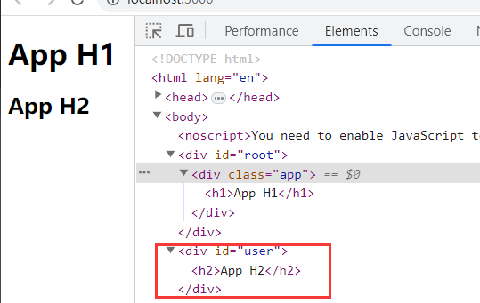
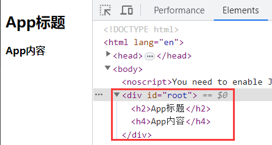

# Portals

- 某些情况下希望渲染的内容独立于父组件，甚至是独立于当前挂载到的 `DOM` 元素中(默认挂载到 `root`)
- `Portal` 提供了一种将子节点渲染到存在于父组件以外的 `DOM` 节点的方案

> **使用 `react-dom` 提供 `createPortal` 的 `API` 实现**

- 第一个参数(child)是任何可渲染的 `React` 子元素，例如一个元素，字符串或 `fragment`
- 第二个参数(container)是挂载目标的 `DOM` 元素

```jsx
import { PureComponent } from 'react'
import { createPortal } from 'react-dom'

class App extends PureComponent {
  render() {
    return (
      <div className='app'>
        <h1>App H1</h1>
        {/* 下面的h2元素被挂载到id为user的根节点下 */}
        {
          createPortal(<h2>App H2</h2>, document.getElementById('user'))
        }
      </div>
    )
  }
}
```



# Fragment

- 在平常的开发中，当一个组件中返回内容较多时，总是需要包裹一个 `<div>` 元素
- 可以使用 `React` 提供的 `<Fragment>` 代替顶层的 `<div>` ，`<Fragment>` 不会被渲染到 `DOM` 结构中
- `Fragment` 允许将子列表分组，而无需向 `DOM` 添加额外节点

```jsx
import { PureComponent, Fragment } from 'react'

class App extends PureComponent {
  render() {
    return (
      <Fragment>
        <h2>App标题</h2>
        <h4>App内容</h4>
      </Fragment>
    )
  }
}

export default App
```



- `Fragment` 支持一种空标签的语法糖写法，但不支持 `key` 或其他属性

```jsx
<>
  <h2>App标题</h2>
  <h4>App内容</h4>
</>
```

- 当标签中有 `key` 时，不可使用空标签，必须写入 `<Fragment>`，**`key` 是唯一可传递给 `Fragment` 的属性**

```jsx
const sections = [
	{ title: '哈哈哈', content: '内容为哈哈哈' },
	{ title: '呵呵呵', content: '内容为呵呵呵' },
	{ title: '嘿嘿嘿', content: '内容为嘿嘿嘿' },
	{ title: '嘻嘻嘻', content: '内容为嘻嘻嘻' },
]

function App() {
  return (
		{sections.map(item => (
    	<Fragment key={item.title}>
      	<h2>{item.title}</h2>
        <h4>{item.content}</h4>
      </Fragment>
     ))}
  )
}
```

# StrictMode

> **`StrictMode` 是一个用来突出显示应用程序中潜在问题的工具**

- 与 `Fragment` 一样，`StrictMode` 不会渲染任何可见的 `Ul`
- 它为其后代元素触发额外的检查和警告
- **严格模式检查仅在开发模式下运行**，不会影响生产构建

> **使用 `StrictMode` 可以为应用程序的任何部分启用严格模式**

- 下面代码中，会对 `Header` 组件以及其所以后代元素都开启严格模式，`Main` 组件则不会

```jsx
import { PureComponent, StrictMode } from 'react'
class App extends PureComponent {
  render() {
    return (
      <div>
        <StrictMode>
          <Header/>
        </StrictMode>
        <Main/>
      </div>
    )
  }
}
```

> **[严格模式检测的内容](https://zh-hans.legacy.reactjs.org/docs/strict-mode.html#detecting-unexpected-side-effects)**

- 识别不安全的生命周期
- 使用过时 `ref API`
- 关于使用废弃的 `findDOMNode` 方法
- 检测意外的副作用，如开启严格模式后组件的 `constructor` 被调用两次，这是严格模式故意为之
- 检测过时的 `context API`
- 确保可复用的 `state`