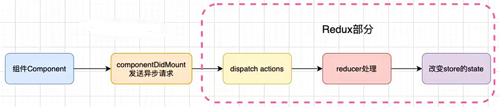
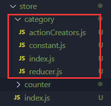

# 为什么需要Redux

- `JavaScript` 需要管理的状态越来越多且复杂，其中**包括服务器返回的数据、缓存数据、用户操作产生的数据**等，也包括一些 **`UI` 的状态**，比如**某些元素是否被选中，是否显示加载动效，当前分页**等

> **`React` 的状态维护问题：**

- `React` 虽然在视图层解决了 `DOM` 的渲染过程，但无论是组件自身的 `state`，还是组件通信的 `props` 传递，或是 `context` 数据的共享，依然是留给开发者来管理
- **React主要负责管理视图**，`state`、`props`、`context` 如何维护最终还是开发者决定

> **管理不断变化的 `state` 的痛点：**

- 状态之间相互会存在依赖，一个状态的变化会引起另一个状态的变化，视图也可能会引起相应变化
- 当应用程序复杂时，`state` 中状态的变化时机、原因、过程等，将变得非常难以控制和追踪

> **使用 `Redux` 的目的：**

- 为了**便于开发者管理不断变化的 `state`**，所以需要 `Redux` 来对 `state` 的状态进行管理

> **`Redux` 是什么？**

- **`Redux` 是一个用于管理 `state` 的容器**：<font color='#61dafb'>**Redux是JavaScript的状态容器，提供了可预测的状态管理**</font>
- `Redux` 除了和 `React` 一起使用之外，也能和其他框架搭配使用(如 `Vue`)，并且体积非常小(只有 `2kb`)

# 核心理念

> **`Redux` 的三个核心理念：**`Store`、`Action`、`Reducer`

- **Store：**集中维护状态的仓库，用于存放数据

- **Action：**普通的 `JavaScript` 对象，用于描述更新的类型和内容，所有数据变化必须通过派发(dispatch) `action` 来更新
  - **使用 `action` 的好处：**可清晰地知道数据如何变化，所有数据的变化都是可跟追、可预测的

- **Reducer：**必须是纯函数，用于将传入的 `state` 和 `action` 结合起来生成一个新的 `state`

# 三大原则

> **保持单一数据源**

- 整个应用程序的 `state` 被存储在一棵 `object tree` 中，并且 `object tree` 只存储在 `store`中
- `Redux` 并没有强制不能创建多个 `store`，但是多个 `store` 不利于数据维护
- 单一数据源可让整个应用程序的 `state` 变得方便维护、追踪、修改

> **`state` 是只读的**

- 修改 `state` 的唯一方法是触发 `action`，不要试图通过其他方式修改 `state`
- 确保视图或网络请求都不能直接修改 `state`，只能通过 `action` 来描述该如何修改 `state`
- 保证所有修改都被集中化处理，并且按照严格的顺序执行，不需要担心竟态问题

> **使用纯函数来执行修改**

- 通过 `reducer` 将旧 `state` 和 `actions` 联系在一起，并且返回一个新的 `state`
- 随着项目复杂度增加，可将 `reducer` 拆分成多个小的 `reducers`，分别操作 `state` 的不同部分
- 所有的 `reducer` 都应该是纯函数，不能产生任何的副作用

# 使用流程

- 安装 `Redux`

```shell
npm i redux
```

- 创建初始的 `state` 对象，用于保存状态，存放于 `reducer ` 集中管理

```javascript
// reducer.js
// 初始化的数据
const initialState = {
  name: 'James',
  age: 38
}

function reducer(state = initialState, action) {
  return state;
}

module.exports = reducer;
```

- 创建 `store` 存储 `state`，必须添加 `reducer`

```javascript
// store/index.js
const { createStore } = require('redux');
const reducer = require('./reducer');

// 创建store
const store = createStore(reducer);

module.exports = store;
```

- 创建 `actionCreators`，用于生成派发的 `action` 对象
  - 通常 `action` 中都会有 `type` 属性，也可以携带其他的数据
  - `dispatch({ type: 'xxx', payload })`

```javascript
// actionCreators.js
const { CHANGE_AGE, CHANGE_NAME } = require('./constants');

// actionCreators：用于生成action
const changeNameAction = (name) => ({
  type: CHANGE_NAME, 
  name
})

const changeAgeAction = (age) => ({
  type: CHANGE_AGE, 
  age
})

module.exports =  {
  changeNameAction,
  changeAgeAction
}
```

```javascript
// constants.js
// 用于保存不变的action.type字段
const CHANGE_AGE = 'change_age'
const CHANGE_NAME = 'change_name'

module.exports = {
  CHANGE_AGE,
  CHANGE_NAME
}
```

- 修改 `reducer` 中的处理代码，`reducer` 必须是纯函数，不能直接修改 `state`

```javascript
const { CHANGE_AGE, CHANGE_NAME } = require('./constants')

/** 
* @param {Object} state store在当前保存的state
* @param {Object} action 本次需要更新的action
* @return {Object} 作为store之后存储的state
*/
function reducer(state = initialState, action) {
  switch(action.type) {
    // 若有新数据更新，则返回新的state
    case CHANGE_NAME:
      return {...state, name: action.name }
    case CHANGE_AGE:
      return {...state, age: action.age }
    default:
      // 若无数据更新，则返回之前的state
      return state
  }
}
```

- 可以在派发 `action` 之前，监听 `store` 的变化，可通过 `store.getState()` 来获取当前的 `state`

```javascript
// 订阅store
const unsubscribe = store.subscribe(() => {
  console.log('订阅数据变化:',store.getState());
})

// 派发action，修改store中的数据，当调用dispatch时就会触发reducer中switch的逻辑
store.dispatch(changeNameAction('Jimmy'))

// 取消订阅
unsubscribe()
```


# 结合React使用

- 在 `React` 中使用 `store`，每个组件都有可能用到，如果在每个组件中都引入 `store` 去进行操作，那么代码重复率就会很高
- 使用第三方库 `react-redux`，可以通过高阶组件的原理对 `store` 的逻辑进行抽取
- 安装 `react-redux`

```shell
npm i react-redux
```

- `react-redux` 内部提供了一个 `Provider` 组件，可以将 `store` 共享到所有组件

```jsx
import { Provider } from 'react-redux';
import store from './store';

// 将store共享到App根组件
<Provider store={store}>
  <App />
</Provider>
```

- 在需要使用 `store` 的组件中，通过 `react-redux` 内部提供的 `connect` 函数，将 `store` 关联起来

> **`connect` 函数接收两个参数，返回一个高阶组件**

- **参数① `mapStateToProps`：**函数，用于将 `state` 中的数据注入到组件的 `props`
- **参数② `mapActionToProps`：**函数，用于将 `action` 映射到组件的 `props`

```jsx
import { PureComponent } from 'react';
import { connect } from 'react-redux';
import { mulCountAction } from '../store/actionCreators';

class About extends PureComponent {
  render() {
    return (
      <div>
        <h2>About Count:{this.props.count}</h2>
        <div className='button-box'>
          <button onClick={e => this.props.mulCount(2)}>x2</button>
          <button onClick={e => this.props.mulCount(5)}>x5</button>
          <button onClick={e => this.props.mulCount(10)}>x10</button>
        </div>
      </div>
    )
  }
}

const mapStateToProps = (state) => ({
  count: state.count // 将state.count映射到this.props.count
})

const mapActionToProps = (dispatch) => ({
  mulCount: (count) => {
    dispatch(mulCountAction(count)) // 将分发action映射到this.props.mulCount
  }
})

export default connect(mapStateToProps, mapActionToProps)(About)
```

# connect实现原理

- `connect` 底层本质上高阶函数 + 高阶组件，即 `connect` 函数接收函数作为参数，首先返回一个函数，返回的函数中又返回了组件，大致结构如下：

```jsx
// connent.js
import { PureComponent } from "react";
import store from '../store';
/**
 * @param {Function} mapStateToProps 用于映射store中各模块state的数据
 * @param {Function} mapActionToProps 用于映射store中各模块的action
 * @return {Function} 高阶组件
 */
export function connent(mapStateToProps, mapActionToProps) {
  return function(Component) {
    return class extends PureComponent {
      render() {
        return <Component {...this.props}/>
      } 
    }
  }
}
```

## 简单封装

- 将 `state` 和 `action` 添加到组件的 `props` 中

```jsx
render() {
  // mapStateToProps = (state) => ({})
  // 这里调用mapStateToProps并传入state，拿到mapStateToProps中映射的数据
  const stateObj = mapStateToProps(store.getState());
  // 同理
  const actionObj = mapActionToProps(store.dispatch)
	// 将state和action添加到组件的props中
  return <Component {...this.props} {...stateObj} {...actionObj}/>
} 
```

- 在返回的新组件中监听 `state` 的变化

```javascript
// 构造函数
constructor() {
  super()
  // 拿到映射的state
  this.state = mapStateToProps(store.getState())
}

componentDidMount() {
  this.unsubcribe = store.subscribe(() => {
    // 因为PureComponent内部会作浅层比较，所以将整个state更新
    this.setState(mapStateToProps(store.getState()))
  })
}
// 取消监听
componentWillUnmount() {
  this.unsubcribe()
}
```

## 解耦store

- 上面由于 `connect` 函数和 `store` 耦合度太高，需要解耦

- 使用 `React.CreateContext` 对 `Store` 创建一个上下文

```javascript
// StoreContext.js
import { createContext } from 'react';
export const StoreContext = createContext();
```

- 新建一个入口文件，将 `StoreContext` 和 `connect` 暴露

```javascript
// index.js
export * from './StoreContext';
export * from './connect'
```

- 使用 ` <StoreContext.Provider>` 对 `App` 根组件进行包裹，共享 `store`

```jsx
import { StoreContext } from './hoc';

<StoreContext.Provider value={store}>
  <App />
</StoreContext.Provider>
```

- 将 `connect` 函数中获取 `store` 的方式改为从 `this.context` 中获取

```javascript
// import store from '../store';
import { StoreContext } from './StoreContext';

// 重写组件的contextType
static contextType = StoreContext;
constructor(props, context) { // 拿到当前context
  super(props)
  this.state = mapStateToProps(context.getState())
}
// 其他原本的 store 改为 this.context
// 如store.getState() → this.context.getState()
```

## 简单使用

- 最后在组件中就可以使用自己封装的 `connect` 函数了，和 `react-redux` 一致

```jsx
import { PureComponent } from 'react';
import { connect } from '../src/hoc';
import { addNum } from './store/modules/counter';

class App extends PureComponent {
  render() {
    const { num, addNum } = this.props
    return (
      <div>
        <h2>App Count: {num}</h2>
        <div className='button-box'>
          <button onClick={e => addNum(1)}>+1</button>
          <button onClick={e => addNum(5)}>+5</button>
          <button onClick={e => addNum(10)}>+10</button>
        </div>
      </div>
    )
  }
}
const mapStateToProps = (state) => ({
  num: state.counter.num
})

const mapActionToProps = (dispatch) => ({
  addNum(num) {
    dispatch(addNum(num))
  }
})

export default connect(mapStateToProps, mapActionToProps)(App)
```


# 异步数据流(redux-thunk)

- 网络请求可以在类组件的 `componentDidMount` 中发送，所以可以有这样的结构：

```javascript
componentDidMount() {
  axios.get(url).then(res => {
    const banners = res.data.banner.list
    this.props.changeBanners(banners)
  })
}
```



- 有个不合理的点：异步请求的数据是需要放到 `Store` 中的，也就是和 `Redux` 相关的，那么**异步请求更改数据应该是属于 `Redux` 的一部分**

- 应该**将异步请求也交给 `Redux` 来管理**，也就是将异步请求放到 `Redux` 的 `action` 中

  - `dispatch` 是个同步操作，并且只能支持传入一个普通对象，如果将 `actionCreator` 改成 `async` 函数，那么他会返回一个 `Promise`

  ```javascript
  // 错误操作,这里action生成器返回的不是普通对象
  const changeBannersAction = async () => {
    const { data:{ data } } = await axios.get(url)
    const banners = data.banner.list
    return { type: actionTypes.CHANGE_BANNERS, banners }
  }
  ```

  - 如果使用 `then` 链式操作，则拿不到服务器返回的数据

  ```javascript
  const changeBannersAction = () => {
    axios.get(url).then(res => {
       const banners = res.data.data.banner.list
    })
  	// 这里拿到不banners
    return { type: actionTypes.CHANGE_BANNERS, banners }
  }
  ```

- 这时需要使用官方推荐的库 `redux-thunk` 对 `store` 增强，让 `dispatch` 可以接收一个函数
- 安装 `redux-thunk`

```shell
npm i redux-thunk
```

- 使用 `redux-thunk` 和中间件增强 `store`
  - **中间件目的：**在 `dispatch` 的 `action` 和最终达到的 `reducer` 之间，扩展一些自己的代码

```javascript
import { createStore, applyMiddleware } from "redux";
import thunk from 'redux-thunk'
import reducer from './reducer'

const store = createStore(reducer, applyMiddleware(thunk))

export default store
```

- 这时 `dispatch` 就能接收函数，并且该函数立即调用，`action` 生成器返回函数，并携带两个参数
  - **`dispatch`：**函数，用于分发 `action`
  - **`getState`：**函数，用于获取 `state` 中的数据

```javascript
const changeBannersAction = () => async (dispatch, getState) => {
  const { data:{ data } } = await axios.get(url)
  const banners = data.banner.list
  dispatch({type: actionTypes.CHANGE_BANNERS, banners})
}
```

- 在组件中映射并调用

```jsx
class Category extends PureComponent {
  componentDidMount() {
    this.props.changeBanners()
  }
}

const mapActionToProps = (dispatch) => ({
  changeBanners(){
    dispatch(changeBannersAction())
  }
})

const mapStateToProps = (dispatch) => ({
  bannners: state.banners
})

export default connect(mapStateToProps, mapActionToProps)(Category)
```

## 中间件原理

- 中间件底层是对原来的处理做了拦截，利用一个 `hack` 技术 `Monkey Patching`，修改原有的程序逻辑
- 例如 `dispatch` 原本只可以传入一个 `action` 对象，使用 `thunk` 后可以传入函数，其实就是底层拦截了`store` 的 `dispatch` 的调用过程

```javascript
const patchingThunk = (store) => {
 const next = store.dispatch;

 const patchingDispatch = (action) => {
  console.log(action);
  next(action)
 };

 store.dispatch = patchingDispatch;
}

patchingThunk(store);
```


## Thunk核心逻辑

- 在调用 `dispatch` 的过程中，真正调用的函数其实是 `patchingDispatch`，那么当 `dispatch` 传入函数时就可以做特殊处理

```javascript
if(Object.prototype.toString.call(action) === '[object Function]'){
  // 这里的dispacth是patchingDispatch，若再次传入函数也可处理
  action(store.dispatch, store.getState)
}else if(Object.prototype.toString.call(action) === '[object Object]' && action.type){
  next(action)
}else {
  // 其他情况则抛出错误
}
```

# 模块拆分

- 如果将所有更新逻辑都放入到单个 `reducer` 函数中，项目将变得难以维护，因此，把 `reducer` 拆分成一个个小模块是很好的编程方式
- 每个模块的 `reducer` 仅负责管理该模块所使用的数据



## 基本拆分

- `reducer` 更新逻辑拆分

```javascript
import * as actionTypes from './constant';

const initialState = {
  banners: [],
  recommends: []
}

function reducer(state = initialState, action) {
  switch(action.type){
    case actionTypes.CHANGE_BANNERS:
      return { ...state, banners: action.banners };
    case actionTypes.CHANGE_RECOMMENDS:
        return { ...state, recommends: action.recommends };
    default:
      return state
  }
}

export default reducer
```

- `actionType` 常量拆分

```javascript
const CHANGE_BANNERS = 'change_banners';
const CHANGE_RECOMMENDS= 'change_recommends';

export { 
  CHANGE_BANNERS,
  CHANGE_RECOMMENDS 
}
```

- `actionCreators` 拆分

```javascript
import * as actionTypes from './constant';
import axios from 'axios';

const fetchHomeMultidataAction = () => async (dispatch) => {
  const { data:{ data } } = await axios.get(url)
  const banners = data.banner.list
  const recommends = data.recommend.list
  dispatch({ type: actionTypes.CHANGE_BANNERS, banners })
  dispatch({ type: actionTypes.CHANGE_RECOMMENDS, recommends })
}

export { 
  fetchHomeMultidataAction
}
```

- `index` 文件负责暴露内容

```javascript
import reducer from './reducer';

export default reducer; // 暴露自己的reducer
export * from './actionCreators'; // 暴露action生成器
```

## 合并reducer

- 当将 `reducer` 拆分成为多个模块后，拆分之后的 `reducer` 都是相同的结构，并且每个 `reducer` 独立负责管理自身 `state` 的更新
- 那么需要用 `Redux` 提供的 `combineReducers` 函数，将各模块的 `reducer` 组合成一个 `Reducer`
- **`combineReducers` 作用：** 把多个不同 `reducer` 作为 `value` 的对象，合并成一个最终的 `reducer` 
- `combineReducers` 函数接收一个拆分后的 `reducer` 函数组成的对象 

```javascript
import { createStore, combineReducers } from "redux";
import counterReducer from './counter';
import categoryReducer from './category';

const reducer = combineReducers({
  counter: counterReducer,
  category: categoryReducer
})

const store = createStore(reducer)

export default store
```

- 合并后的 `reducer` 可调用各模块的 `reducer`，并将它们的返回结果合并成一个 `state` 对象
- 由 `combineReducers` 返回的 `state`，会将传入的每个 `reducer` 返回的 `state` 按对应的 `key` 命名


- 获取 `state` 数据时，需要按模块名称区分

```javascript
const mapStateToProps = (state) => ({
  count: state.counter.count, // 获取counter模块的state数据
  banners: state.category.banners, // 获取category模块的state数据
  recommends: state.category.recommends
})
```

- 使用 `action` 需要在对应的模块下引入

```javascript
import { mulCountAction } from '../store/counter';
import { fetchHomeMultidataAction } from '../store/category'
```

# RTK工具包

- `Redux Toolkit` 是官方推荐用于编写 `Redux` 逻辑的工具包
- 由于 `Redux` 的逻辑编写过于繁琐，并且代码通拆分在多个文件中，`Redux Toolkit` 旨在成为编写 `Redux` 逻辑的标准方式，从而解决代码繁琐的问题
- 安装 `Redux Toolkit`

```shell
npm i @reduxjs/toolkit
```

> **`Redux Toolkit` 的核心 `API` 主要如下：**

- **configureStore：**包装 `createStore` 以提供简化的配置选项和良好的默认值，可以自动组合拆分的`reducer`，添加提供的任何 `Redux` 中间件(默认包含`redux-thunk`)，并启用 `Redux DevTools`
- **createSlice：**接受 `reducer` 函数的对象、切片名称和初始状态值，自动生成切片 `reducer`，并带有相应的`actions`
- **createAsyncThunk：**接受一个 `actionType` 字符串和一个返回 `Promise` 的函数，生成一个基于该`Promise` 分派 `actionType` 的 `thunk`

## 基本使用

- 原来的拆分模式是每个模块都有属于各自的 `reducer`，`actionCreators`，使用 `RTK` 工具包对其重构
- **`RTK` 工具包官网：**https://redux-toolkit.js.org/

> 通过 `createSlice` 创建切片，**`createSlice` 主要包含以下参数**

- **name：**标记切片的名词，会在 `redux-devtool` 中显示
- **initialState：**第一次初始化的值
- **reducers：**由函数组成的对象，相当于 `reducer` 函数，内部的函数类似每个 `action` 操作

- **返回值：**一个对象，包含所有的 `actions` 和 `reducer`

```javascript
// store/counter.js
import { createSlice } from '@reduxjs/toolkit';

const counterSlice = createSlice({
  name: 'counter',
  
  initialState: {
    num: 888
  },
  
  reducers: {
    addNum(state, action) {
			state.num += action.payload; // 这里做了优化，不需要返回新的state
    },
    subNum(state, action) {
			state.num -= action.payload;
    }
  }
})

export const { addNum, subNum } = counterSlice.actions
export default counterSlice.reducer
```

> 使用 `configureStore` 创建 `store` 对象，**常见参数如下：**

- **reducer：**将 `slice` 中的 `reducer` 组成一个对象传入
- **middleware：**可以使用参数，传入其他的中间件，默认集成 `redux-thunk` 和 `redux-devtool`
- **devTools：**是否配置 `devTools` 工具，默认为 `true`

```javascript
import { configureStore } from '@reduxjs/toolkit';
import counterReducer from './modules/counter';

const store = configureStore({
  reducer: {
    counter: counterReducer
  },
  devTools: true
})

export default store
```

- 组件中使用还是通过 `react-redux` 的 `Provider` 共享和 `connect` 映射

## 异步操作(createAsyncThunk)

- `Redux Toolkit` 默认已经集成了 `Thunk` 相关的功能：**createAsyncThunk**

```javascript
import { createAsyncThunk } from '@reduxjs/toolkit';
import axios from 'axios';

export const fetchBannersAction = createAsyncThunk('fetch/banners', async () => {
  const { data: { data } } = await axios.get(url);
  return data
})
```

> **使用 `createAsyncThunk` 创建出来的 `action` 被 `dispatch` 时，存在三种状态：**

- **pending：**`action` 被发出，但还没有最终的结果
- **fulfilled：**成功获取到最终的结果
- **rejected：**执行过程中出现错误或者抛出异常

```javascript
const homeSlice = createSlice({
  name: 'home',
  initialState: {
    banners: []
  },
  reducers: {},
  // 针对异步的action
  // extraReducers使用对象的写法在RTK2.0中准备弃用
  extraReducers: (builder) => {
    builder.addCase(fetchBannersAction.pending, (state, action) => {
      console.log(action.type); // fetch/banners/pending
    })
    .addCase(fetchBannersAction.fulfilled, (state, action) => {
      state.banners = action.payload.banner.list;
    })
    .addCase(fetchBannersAction.rejected, (state, action) => {
      console.log(action.type);
    })
  }
})
```

- 在不用 `extraReducers` 的情况下，使用普通的 `reducers` 也可改变 `state` 中的数据

> **`createAsyncThunk` 中的回调函数还有两个额外的参数：**

- **extraInfo**：额外信息，在调用 `createAsyncThunk` 返回的 `Action ` 函数时传入的数据

- **store：**完整的 `store`

```javascript
export const fetchBannersAction = createAsyncThunk('fetch/banners', async (extraInfo, store) => {
  const { data: { data } } = await axios.get('http://123.207.32.32:8000/home/multidata');
  store.dispatch(changeBanners(data.banner.list)) // 这里可以直接分发action
})

const homeSlice = createSlice({
  name: 'home',
  initialState: {
    banners: []
  },
  reducers: {
    changeBanners(state, action) {
      state.banners = action.payload
    }
  },
})

export const { changeBanners } = homeSlice.actions;
export default homeSlice.reducer;
```

- 向上面的做法也可以分发 `action`，但还是**使用官方推荐的 `extraReducers`**

## 数据不可变(Immutable)

- 在 `React` 开发中，无论是类组件中的 `state`，还是 `redux` 中管理的 `state`，甚至在整个 `JavaScript` 编码过程中，数据的不可变性都是非常重要的，所以 `React` 经常会进行浅拷贝来完成某些操作

> **浅拷贝事实上也是存在问题：**

- 对过大的对象进行浅拷贝会造成性能的浪费
- 浅拷贝后的对象，在作深层改变时，依然会对之前的对象产生影响

```javascript
const friends = [
  { name: 'Jimmy' }
];

const newFriend = [ ...friends ];
newFriend[0].name = 'James' // 这里改变newFriend，friends里的对象也会被改变
```

- 事实上 `Redux Toolkit` 底层使用了 [immerjs](https://mp.weixin.qq.com/s/hfeCDCcodBCGS5GpedxCGg) 库来保证数据的不可变性
  
- **`Immutable` 对象的特点：**只要修改了对象，就会返回一个新对象，旧对象不会发生改变

> **为了节约内存使用新的算法：**Persistent Data Structure(持久化数据结构)

- 用一种数据结构来保存数据
- 当数据被修改时会返回一个对象，但新对象会尽可能利用之前的数据结构，而不会对内存造成浪费

  