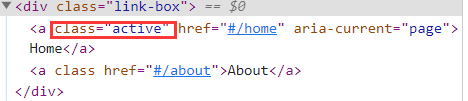
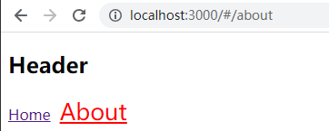
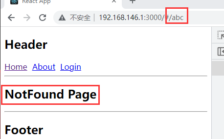
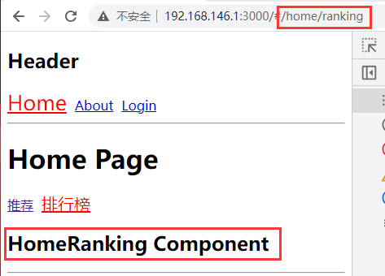

# 路由概念

- **核心：**改变 `URL` ，但是页面不进行整体的刷新
- **作用**：维护 `URL` 和渲染页面的映射关系
- **目的：** 通过 `JavaScript` 监听 `URL` 的改变，并且根据 `URL` 的不同重新渲染页面
- 改变 `URL` 但不刷新页面的两种方式：
  - 通过 `URL` 的 `hash` 改变 `URL`
  -  通过  `HTML5` 的 `history` 模式改变 `URL`

- `React Router` 目前最新版本是 `6.x`，已经非常稳定
- **安装 `React Router`：**选择 `react-router-dom`，因为 `react-router`会包含 `react-native` 的内容，`web` 开发并不需要

```shell
npm i react-router-dom
```

# 基本使用

- `react-router` 最主要的 `API` 是提供的一些组件：`BrowserRouter` 和 `HashRouter`
  - **BrowserRouter：**使用 `history` 模式
  - **HashRouter：**使用 `hash` 模式
- `Router` 中包含对路径改变的监听，并且会将相应的路径传递给子组件

```jsx
import { HashRouter } from 'react-router-dom';

<HashRouter>
  <App />
</HashRouter>
```

## 映射配置

- **Routes：**包裹所有的 `Route` ，在其中配置路由的映射关系
  - **注意：**`Router5.x` 使用的是 `Switch` 组件
- **Route：**`Route` 用于路径的匹配
  - **path属性：**用于设置匹配到的路径
  - **element属性：**匹配到对应路径后需要渲染的组件;
    - `Router5.x` 使用的是 `component` 属性
  - **exact：**精准匹配，只有精准匹配到完全一致的路径才渲染对应组件
    - `Router6.x` 不再支持该属性

```jsx
import { Route, Routes } from 'react-router-dom';

{/* 映射关系：path => Component */}
<div className="content">
  {/* 映射关系：path => Component */}
  <Routes>
    <Route path='/' element={<Home/>} />
    <Route path='/home' element={<Home/>} />
    <Route path='/about' element={<About/>} />
  </Routes>
</div>
```

## 跳转配置

- **Link：**通常路径的跳转是使用 `Link` 组件，最终会被渲染成 `a` 元素
  - **to属性：**`Link` 中最重要的属性，用于设置跳转的目标路径
  - **replace属性：**使用目标路径直接替换当前路径
  - **reloadDocument：**是否重新加载页面，默认 `false`

```jsx
import { Link } from 'react-router-dom';

<div className="link-box">
  <Link to="/home">Home</Link>
  <Link to="/about">About</Link>
</div>
```

- **NavLink：**在 `Link` 基础之上增加了一些样式属性
  - **style属性：**传入函数，函数接受一个对象，包含 `isActive` 属性
  - **className属性：**和 `style` 属性同理

```jsx
import { NavLink } from 'react-router-dom';

const getActiveClass = ({isActive}) => {
  return isActive ? 'link-active' : ''
};

const getActiveStyle = ({isActive}) => {
  return { color: isActive ? 'red' : '' }
};

<div className="link-box">
	<NavLink to="/home" style={this.getActiveStyle}>Home</NavLink>
	<NavLink to="/about" className={this.getActiveClass}>About</NavLink>
</div>
```

- `NavLink` 也可以对激活时添加的 `active` 类自定义样式



```css
.link-box {
  .active {
    color: red;
    font-size: 25px;
  }
}
```



## Navigate导航

- `Navigate` 用于路由的重定向，当这个组件出现时，就会执行跳转到对应的 `to` 路径中
  - `Router5.x` 使用的是 `Redirect`

```jsx
import { Navigate } from 'react-router-dom';

<Navigate to='/home'/>
```

- 当用户第一次访问页面时，可以使用 `Navigate` 组件作重定向操作

```jsx
import { Routes, Route, Navigate } from 'react-router-dom';

<Routes>
  <Route path='/' element={<Navigate to='/home' />}/>
  <Route path='/home' element={<Home/>} />
</Routes>
```

## Not Found配置

- 当访问不存在的 `URL` 时，使用 `*` 通配符匹配一个404兜底路由

```jsx
<Route path='*' element={<NotFound/>} />
```



# 路由嵌套

- 在开发中路由之间是存在嵌套关系的，可以使用<Route>组件以嵌套的形式配置

```jsx
import { Routes, Route, Navigate } from 'react-router-dom';
<Routes>
  <Route path='/home' element={<Home/>} >
    {/* 配置子路由 */}
    <Route path='/home' element={<Navigate to='/home/recommend' />} />
    <Route path='/home/recommend' element={<HomeRecommend/>} />
    <Route path='/home/ranking' element={<HomeRanking/>} />
  </Route>
</Routes>
```

- 使用<Outlet>组件，用于在父路由元素中作为子路由的占位元素

```jsx
// Home.jsx
import { NavLink, Outlet } from 'react-router-dom';

<div>
  <h1>Home Page</h1>
  <div className='home-nav'>
    <NavLink to="/home/recommend">推荐</NavLink>
    <NavLink to="/home/ranking">排行榜</NavLink>
  </div>
  {/* 占位 */}
  <Outlet/>
</div>
```



# 编程式路由

- 通过<Link>或者<NavLink>进行跳转，也可以通过 `JavaScript` 代码进行跳转
- 在 `Router6.x` 版本之后，编程式路由的 `API` 都迁移到了 `Hooks` 的写法
- 可以通过 `react-router-dom` 提供的 `useNavigate` 的 `Hook` 获取到 `navigate` 函数进行操作

```jsx
function App(props) {
  const navigate = useNavigate()

  return (
  	<AppWrapper>
  	  <button onClick={e => navigate('/category')}>分类</button>
  	  <button onClick={e => navigate('/order')}>订单</button>
  	</AppWrapper>
  )
}
```

- **注意：** `Router6.x` 版本提供的 `Hook` **只能在函数式组件中使用**，类组件中则无法使用
- 如果想要在类组件中使用 `Hook`，可以通过高阶组件进行封装，将 `hook` 传到组件的 `props` 上

```jsx
import { useNavigate } from 'react-router-dom';

export default function withRouter(Component) {
  return function(props) {
    const navigate = useNavigate();
    return <Component {...props} router={{navigate}}/>
  }
}
```

```jsx
import { useNavigate } from 'react-router-dom';
import withRouter from '../hoc/withRouter';

class Home extends PureComponent {
  render() {
    const { navigate } = this.props.router;
    return <button onClick = {e => navigate('/home/songMenu')}>歌单</button>
  }
}

export default withRouter(Home)
```

-  `navigate` 函数可以接收三个参数
  - **to：**跳转的目标路径(必传)
  - **options：**对象，`{replace: boolean, state: any}`，使用 `replace` 可更改跳转方式
  - **delta：**步数，如 `navigate(1)` 前进一步

# 参数传递

- `React` 中通过路由传递参数有两种方式：
  - 通过动态路由的方式(params)
  - 通过查询字符串传递参数(query)

## 动态路由(params)

- **动态路由概念：**路由中的路径并不固定，如 `/detail/:id`，那么 `/detail/abc`、`/detail/123`都可以匹配到该 `Route`，这种匹配规则称为动态路由
- 通常情况下，使用动态路由可以为路由传递参数

```jsx
<Route path='/detail/:id' element={<Detail/>} />
```

- 在点击跳转时可以在路径后携带

```jsx
import { useNavigate } from 'react-router-dom';
const navigate = useNavigate();

<button onClick={e => navigate(`/detail/${id}`)}>详情</button>
```

- 获取方式则是通过 `useParams` 这个 `hook`

```jsx
import { useParams } from 'react-router-dom';
const params = useParams();

<h2>id:{params.id}</h2>
```

## 查询字符串(query)

- 通过查询字符串传参，则是在跳转对应 `URL` 拼接参数，如 `/detail?id=111&name=tony`，路由配置仍然是固定写法

```jsx
<Route path='/detail' element={<Detail/>} />
```

- 在点击跳转时可以在路径后拼接需要传递的参数

```jsx
import { useNavigate } from 'react-router-dom';
const navigate = useNavigate();

<button onClick={e => navigate(`/detail/?id=${id}`)}>详情</button>
```

- 可以通过 `useSearchParams` 这个 `hook` 获取
  - `useSearchParams` 返回一个数组，数组中携带两个元素
    - **searchParams：**携带路由参数的键值对列表
    - **setSearchParams：**修改路由参数的方法

```jsx
const [ searchParams ] = useSearchParams();
const query = Object.fromEntries(searchParams); // 转化为普通对象

<h2>id:{query.id}</h2>
```

- 也可以通过 `useLocation` 这个 `hook` 获取，但获取到的形式为 ` "?id=111" `，需要自行处理

```jsx
const { search } = useLocation(); // 返回一个location对象，路由传递的参数在search属性中
const query = { id: search.split('=').pop() }; // 处理参数

<h2>id:{query.id}</h2>
```

# 配置文件

- 如果将路由的映射配置都使用<Route>写在组件内部，那么路由会变得非常混乱
- 可以使用 `routes` 映射配置文件，结合 `useRoutes` 进行渲染
  - **注意：**早期的 `Router` 并没有提供相关的 `API`，需要借助于 `react-router-config` 完成
- 路由映射文件如下，类似 `VueRouter` 的配置

```jsx
const routes = [
  {
    path: '/',
    element: <Navigate to="home"/>
  },
  {
    path: '/home',
    element: <Home/>,
    children: [
      {
        path: '/home',
        element: <Navigate to="/home/recommend"/>
      },
      {
        path: '/home/recommend',
        element: <HomeRecommend />
      },
      // ...
    ]
  }
  // ...
  {
    path: '*',
    element: <Category />,
  }
]

export default routes;
```

- 使用 `useRoutes` 这个 `Hook` 渲染

```jsx
import { NavLink, useNavigate, useRoutes } from 'react-router-dom';
import routes from './router';

<div className="content">
	{ useRoutes(routes) }
</div>
```

# 路由懒加载

- `React` 中使用路由懒加载，需要使用 `React.lazy()` 方法和 `Suspense` 组件结合
- 定义需要懒加载的路由

```javascript
const Home = React.lazy(() => import('../pages/Home'))
const HomeRecommend = React.lazy(() => import('../components/HomeRecommend'))
const About = React.lazy(() => import('../pages/About'))
const Login = React.lazy(() => import('../pages/Login'))
```

- 使用 `Suspense` 组件对 `App` 根组件进行包裹，并且添加 `fallback` 属性
  -  `fallback` 属性中的内容是路由组件还没完成加载时所显示的内容

```jsx
import { Suspense } from 'react';
import { HashRouter } from 'react-router-dom';

<HashRouter>
  <Suspense fallback={<h1>Loading</h1>}>
    <App />
  </Suspense>
</HashRouter>
```