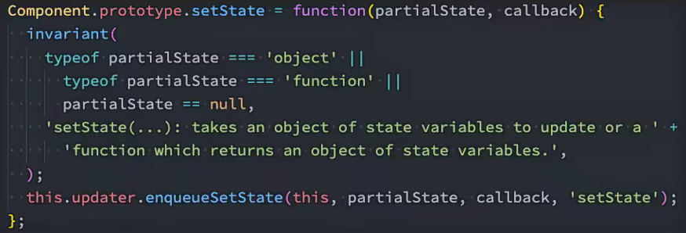
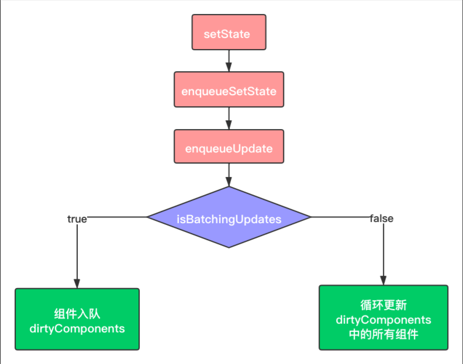
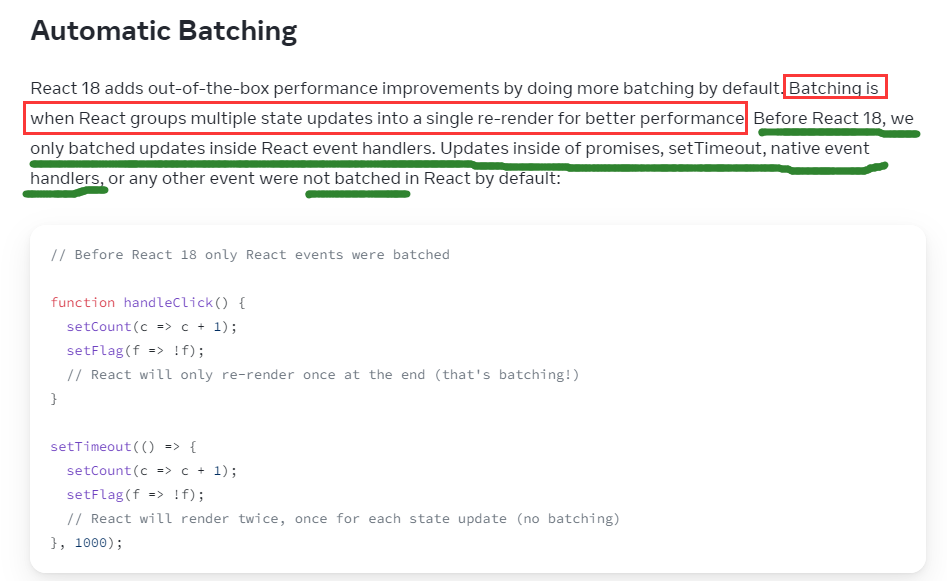

# 为何使用setState

- `React` 中并不能直接通过修改 `state` 的值来让界面发生更新
- 因为 `React` 并没有实现类似 `Vue2` 中的 `Object.defineProperty`，或是 `Vue3` 中的 `Proxy` 的方式进行数据劫持，监听数据的变化
- 所以必须**通过调用 `setState` 来告知 `React` 数据已经发生了变化**
- `setState` 方法是从 `Component` 中继承过来的



# setState更多用法

- **①传入对象**，告知 `React` 需要更新 `state` 中的哪些数据
  - 这里传入一个对象，`React` 底层实际上是**将该对象和 `this.state` 做了一个合并的操作**，然后在合适的时机，重新调用了 `render` 函数
  - 通过 `Object.assign(传入对象, this.state)` 合并，更新 `state` 中的数据

```javascript
this.setState({
  text: '你好啊,React'
})
```

- **②传入回调函数**，该回调函数返回一个需要修改的数据对象
  - 可以在该回调函数中编写**如何修改 `state` 中数据**的逻辑，耦合性更强
  - 当前的回调函数会将更新前的 `state` 和 `props` 传递进来，不需要通过 `this` 获取
  - 如果在该函数中通过 `this.state` 访问数据，依然是

```javascript
this.setState((state, props)=>{
  return { text: '你好啊,React' }
})
```

- **③传入第二个参数**，`setState` 中第二个参数是一个回调函数
  - 在 `React` 的事件处理中，`setState` 是异步调用的，如果想要在修改数据后立马拿到最新的数据实现其他的操作，可以在该回调函数中处理
  - 该回调函数是在数据已经完成更新后触发，可拿到最新的数据

```javascript
this.setState({
  text: '你好啊,React'
}, () => {
  console.log('+++++', this.state.text); // +++++ 你好啊,React
})

console.log('-----', this.state.text); // ----- Hello,React
```

# setState调用原理



- ①首先调用 `setState` 入口函数，入口函数充当一个分发器的角色，根据入参决定分发到对应的功能函数中

```javascript
ReactComponent.prototype.setstate = function (partialstate，callback) {
	this.updater.enqueueSetState(this, partialstate);
  // 如果setState传入第三个参数，则再次调用enqueueCallback
	if(callback) {
		this.updater.enqueueCallback(this, callback， "setstate");
	}
});
```

- ②在 `enqueueSetState` 方法中，将新的 `state` 放进组件的状态队列里，并调用 `enqueueUpdate` 来处理将要更新的实例对象

```javascript
enqueuesetstate: function (publicInstance，partialstate) {
  // 根据this拿到对应的组件实例
	var internalInstance = getInternalInstanceReadyForUpdate(publicInstance, 'setstate');
  // 这个queue对应的就是一个组件实例的state数组
	var queue = internalInstance._pendingStateQueue ||(internalInstance._pendingStateQueue)
  queue.push(partialstate);                                
 	// enqueueUpdate用来处理当前的组件实例
 	enqueueUpdate(internalInstance);
}
```


# setState异步更新

> **`setState` 为何设计是异步更新？(就`React18` 之后而言)**

- `setState` 设计为异步可以显著的提升性能

  - 如果每次调用 `setState` 都进行一次更新，那么意味着 `render` 函数会被频繁调用，界面重新渲染，这样会导致效率很低
  - 最好是将每次的 `setState` 放入到一个任务队列中(微任务)，`React` 事件逻辑处理(宏任务)完成后，再把队列中的 `setState` 按顺序处理
  - 这样一次性获取到多个 `setState` 调用，然后再进行批量更新，就不会频繁触发 `render`

  ```javascript
  // 假设setState是同步
  handleCountChange() {
    // 网络请求1完成后...
    this.setState({
      ...
    })
    // 调用render()
    
    // 网络请求2完成后...
    this.setState({
      ...
    })
    // 调用render()
    
    // 网络请求3完成后...
    this.setState({
      ...
    })
    // 调用render()
  }
  ```

- 如果同步更新 `state`，但还没有执行 `render` 函数，那么 `state` 和 `props` 不能保持同步
  - **假设 `setState` 是同步更新**，那么在调用 `setState` 后，`this.state` 中的数据会立即更新，此时在 `render`函数执行之前，`render` 函数中组件传递的 `props` 依然是更新前的数据
  - 这就会导致 `state` 和 `props` 不能保持一致性，数据出现混乱，开发中可能会产生许多问题

```jsx
import { Component } from 'react'

class App extends Component {
  constructor() {
    super()
    this.state = {
      text: 'Hello,React',
    }
  }

  handleTextChange() {
    // 假设setState同步更新
    this.setState({
      text: '你好啊,React'
    })
    
    // 在这里之后，state中的数据会立即更新
    // this.state = {
    //   text: '你好啊,React'
    // }
    
    // 假如此时并未render函数并未重新执行
  }

  render() {
    const { text } = this.state // 这里的text依然是'Hello,React'
    return (
      <div>
        <button onClick={e => this.handleTextChange()}>修改文本</button>
        {/* // 这里的text依然是'Hello,React' */}
        <HelloWorld text={text}/>
      </div>
    )
  }
}
```

# setState同步做法

- 在 `React18` 之前， `setState` 在某些情况下是同步的

  - 在 `setTimeout` 中调用 `setState`

  ```javascript
  setTimeout(() => {
    this.setState({
      text: '你好啊,React'
    })
    console.log(this.state.text);
  }, 0);
  ```

  - 原生DOM事件回调中调用 `setState`

  ```javascript
  const btnEl = document.querySelector('btn')
  
  btnEl.addEventListener('click', () => {
    this.setState({
      text: '你好啊,React'
    })
    console.log(this.state.text);
  })
  ```

- **总结：**在 `React18` 之前，`setState` 可以分为同步和异步
  - 在组件生命周期或 `React` 合成事件中，`setState` 是异步
  - 在 `setTimeout`、原生 `DOM` 事件、`Promise` 回调中，`setState` 是同步
- 在 `React18` 之后，默认所有的 `setState` 都是异步处理，实现批量更新



- 在 `React18` 之后如果想实现同步的效果，即调 `setState` 后立马拿到最新数据，可以手动做一次批量更新
- `react-dom` 提供了一个名为 `flushSync` 的 `API`，用于实现这种同步效果

```javascript
import { flushSync } from 'react-dom'

// 这里相当于一次批处理，flushSync回调执行完后立马执行一次render函数
flushSync(() => {
  this.setState({
    text: '你好啊,React'
  })
});

console.log(this.state.text); // '你好啊,React'
```