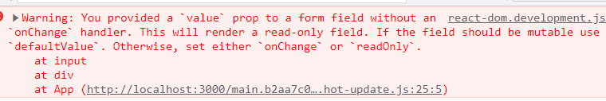

# 受控组件

- 在 `React` 中，`HTML` 表单的处理方式和普通 `DOM` 元素不太一样，表单元素(如<input>、<select>等)通常需要维护自己的 `state`，并根据输入进行更新

- 在 `React` 中，可变状态通常保存在组件的 `state` 中，并且只能通过使用 `setState()` 来更新
  - 将两者结合起来，**使 `React` 的 `state` 成为"唯一数据源"**
  - 渲染表单的 `React` 组件还控制着用户输入过程中表单发生的操作
  - **被 `React` 以这种方式控制取值的表单元素称为"受控组件"**
- 大多数情况下**推荐使用受控组件来处理表单数据**，受控组件的数据由 `React` 的 `state` 驱动 

```jsx
<input type="text" value={username} onChange={e => this.inputChange(e)} />

inputChange(event) {
  this.setState({ username: event.target.value})
}
```

- 例如上面 `input` 元素，设置了 `value` 属性，那必须对其 `onChange` 事件进行处理，保持 `state` 的更新
- 若不处理 `onChange` 事件，输入框则无法输入内容，这保证了 `React` 的 `state` 成为唯一数据源



## input处理多输入

- 当需要处理多个 `input` 元素时，可以给每个元素添加 `name` 属性，并让处理函数根据 `event.target.name` 的值选择要执行的操作

```jsx
this.state = {
  username: '';
  password: ''
}

<label htmlFor="username">
  用户：
  <input type="text" id="username" name="username" value={username}
    onChange={e => this.handleInputChange(e)}
  />
</label>
<label htmlFor="password">
  密码：
  <input type="text" id="password" name="password" value={password}
    onChange={e => this.handleInputChange(e)}
  />
</label>

handleInputChange(event) {
  this.setState({
    // 使用计算属性名称更改state
    [event.target.name]: event.target.value
  });
}
```

## checkbox单选和多选

- 当使用 `checkbox` 时，需要从 `event.target.checked` 上获取最新的布尔值
- 使用单选框受控组件

```jsx
this.state = {
  isAgree: false;
}

<label htmlFor="agree">
  <input type="checkbox" id="agree" checked={isChecked} 
  onChange={e => this.handleCheckChange(e)} 
  /> 同意
</label>

handleCheckChange(event) {
  this.setState({ 
    isAgree: event.target.checked
  })
}
```

- 使用多选框受控组件

```jsx
this.state = {
  hobbies: [
    { value:'sing', text:'唱', isChecked: false },
    { value:'dance', text:'跳', isChecked: false },
    { value:'rap', text:'rap', isChecked: false },
  ]
}

<div>
  {
    hobbies.map((item, i)=>{
    return (
      <label htmlFor={item.value} key={item.value}>
        <input type="checkbox" id={item.value} checked={item.isChecked}
          onChange={e => this.handleHobbiesChange(e, i)}
        /> 
        {item.text}
      </label>
      )
    }) 
  }
</div>

handleHobbiesChange(event, index) {
  const hobbies = [...this.state.hobbies]
  hobbies[index].isChecked = event.target.checked
  this.setState({ hobbies })
}
```

## select单选和多选

- `select` 受控组件和 `input` 类似，`React` 并不会使用 `selected` 属性，而是使用根 <select>标签上使用 `value` 属性 
- `select` 单选使用

```jsx
this.state = {
  fruit: 'apple'
}

<select value={fruit} onChange={e => this.handleSelectChange(e)}>
  <option value="apple">苹果</option>
  <option value="mango">芒果</option>
  <option value="banana">香蕉</option>
</select>

handleSelectChange(event) {
  this.setState({
    fruit: event.target.value
  });
}
```

- `select` 多选使用，在多选的情况下，<select>根标签的 `value` 需要绑定一个数组，并且在 `onChange` 中需要通过 `event.target.selectedOptions` 获取当前选中的所有项

```jsx
this.state = {
  fruit: ['apple']
}

<select multiple value={fruit} onChange={e => this.handleSelectChange(e)}>
  <option value="apple">苹果</option>
  <option value="mango">芒果</option>
  <option value="banana">香蕉</option>
</select>

handleSelectChange(event) {
  const options = Array.from(event.target.selectedOptions, item => item.value)
  this.setState({ fruit: options });
}
```

# 非受控组件

- `React` 推荐大多数情况下使用受控组件来处理表单数据，另一种替代方案是使用非受控组件，这时表单数据将交由 `DOM` 节点来处理

- 如果要使用非受控组件中的数据，那么需要使用 `ref` 从 `DOM` 节点中获取表单数据，并且使用 `defaultValue` 属性设置其默认值

```jsx
import { PureComponent, createRef } from 'react'

class App extends PureComponent {
  constructor() {
    super()
    this.state = {
      nickname: "tony"
    }
    this.inputRef = createRef()
  }

  componentDidMount() {
    this.inputRef.current.addEventListener('input', (event)=>{
      this.setState({ nickname: event.target.value })
    })

  }

  render() {
    const { nickname } = this.state
    return <input type="text" ref={this.inputRef} defaultValue={nickname}/>
  }
}
```

- 如果是 `checkbox` 和 `radio`，需要使用 `defaultChecked`

```jsx
<input type="checkbox" ref={this.inputRef} defaultChecked={nickname}/>

<input type="radio" ref={this.inputRef} defaultChecked={nickname}/>
```

- 开发中更推荐受控组件，让数据交由 `React` 的 `state` 管理