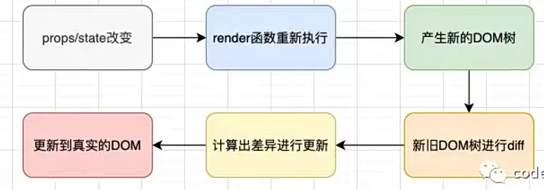
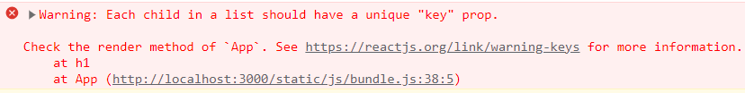
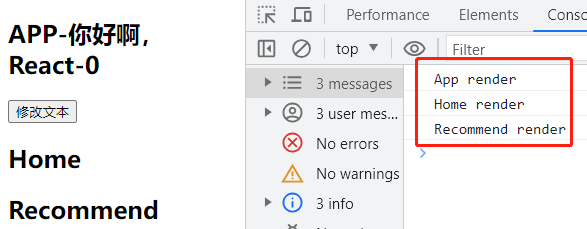
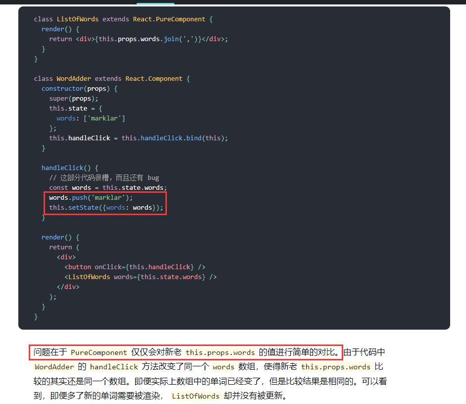
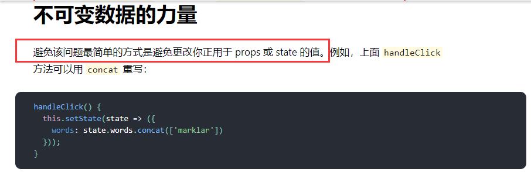

# 更新机制

- **`React` 更新流程**如下：



- `React` 在 `props` 或 `state` 发生改变时，会调用 `React` 的 `render` 方法，会创建不同的 `DOM` 树
- `React` 需要基于这两棵不同的树之间的差别来判断如何有效的更新 `UI`
  - 如果进行**全量比较更新(旧 `DOM` 树的每个节点都和新 `DOM` 树每个节点比较)**，即使是最先进的算法，其复杂度也需要 `O(n²)`，其中 `n` 是树中元素的数量
  - 这种全量比较更新的算法会使得 `React` 更新性能变得低效
- 于是 `React` 对这个算法的复杂度优化为 `O(n)`，优化手段如下：
  - 同层节点之间相互比较，不会跨节点比较
  - 不同类型的节点，产生不同的树结构
  - 通过 `key` 来指定哪些节点在不同的渲染下保持稳定

# key的优化

- 在通过循环遍历生产 `DOM` 结构时，如果没有绑定 `key` 属性，浏览器会发出警告



- 需要给每个遍历生成的 `DOM` 节点绑定一个唯一的 `key` 属性
- `React` 在对比更新时，会在旧 `DOM` 树通过 `key` 来匹配新 `DOM` 树上对应的元素
  - **在 `DOM` 树最后新增元素：**这时候有无 `key` 属性的意义不大
  - **在 `DOM` 树前面或者中间新增元素：**
    - **没有绑定 `key` ：**在新增元素的位置到最后的 `DOM` 节点都会进行修改
    - **绑定 `key`：**通过 `key` 找到对应元素进行移位复用，不需要修改任何 `DOM` 元素，只需将新增元素插入到对应的位置即可

- **`key` 的注意事项**
  - `key` 应该是唯一的
  - `key` 不要使用随机数(随机数在下一次 `render` 时，会重新生成)
  - 若使用索引作为 `key`，对性能则没有优化

# render优化

- 当父组件调用 `setState` 更改数据时，组件本身会重新调用 `render` 函数，但是子组件的 `render` 函数也都会被重新调用

```jsx
class App extends Component {
  constructor() {
    super()
    this.state = {
      text: 'Hello,React',
    }
  }
  changeText() {
   this.setState({text: '你好啊，React'}) 
  }
  render() {
    console.log('App render');
    const { text } = this.state
    return (
      <div>
        <h2>APP-{text}</h2>
        <button onClick={e => this.changeText()}>修改文本</button>
        <Home/>
        <Recommend/>
      </div>
    )
  }
}
```



- 如果只是修改了组件本身中的数据，其自身和所有后代组件的 `render` 函数都会被重新调用，进行 `diff` 算法，这样会造成性能很低
  - 实际上很多组件都没有必要重新 `render`
  - 调用 `render` 应该有一个前提，那就是依赖的数据(state、props)发生改变时，再调用 `render` 方法

- `React` 提供了一个生命周期函数 `shouldComponentUpdate`，可用于控制是否调用 `render`，
- 该生命周期函数提供了两个参数
  - **第一个参数`newProps`：**修改之后的 `props` 属性
  - **第二个参数`newState`：**修改之后的 `state` 属性
- 并且需要有返回值，返回值是一个布尔类型
  - **返回 `true`：**需要调用 `render` 函数
  - **返回 `false`：**不调用 `render` 函数
  - 默认返回 `true`，即只要调用 `setState` 都会重新 `render`

```javascript
shouldComponentUpdate(newProps, newState) {
  if(this.state.text !== newState.text) return true
  return false
}
```

# PureComponent

- 在数据非常庞大的时候，如果所有组件都要手动实现 `shouldComponentUpdate`，那么工作量则一言难尽
  - **使用 `shouldComponentUpdate` 的目的：**根据 `props` 或 `state` 中的数据是否发生了改变，来决定是否需要重新执行 `render` 函数

- `React` 提供了一个叫 `PureComponent` 的类，其内部已经实现了这种机制
- 让组件继承 `PureComponent` 

```javascript
import { PureComponent } from 'react'

class App extends PureComponent { }
```

- 那么函数式组件中不能继承 `PureComponent`，需要使用高阶函数 `memo` 对其进行包裹，实现这种机制

```javascript
import { memo } from 'react'
const App = memo(function(props) {})
```

## 数据的不可变性

- 其实 `PureComponent` 内部只做了浅层比较，即如果在 `props` 或 `state` 中存在引用类型的数据，那么修改其深层数据时，`PureComponent` 是无法判断的

```jsx
class App extends PureComponent {
  constructor() {
    super()
    this.state = {
      books: [
        { name:'你不知道的JavaScript', price: 99, count: 1 },
      ]
    }
  }
  
  addNewBook() {
    const newBook = { name:'React高级设计', price: 118, count: 1 };
    // 改变了state中的books
    this.state.books.push(newBook)
    // 调用setState
    this.setState({
      books: this.state.books
    })
  }
  
  render() {
    const { books } = this.state
    return (
      <div>
        <button onClick={e => this.addNewBook()}>添加新书籍</button>
      </div>
    )
  }
}
```

- 当组件继承自 `PureComponent` 时，上面的做法并不会让界面更新，官方文档中也建议不能使用这种做法



- 官方文档的意思是，在修改引用类型的深层数据时，`PureComponent` 内部比较的是其引用指针，并且避免这种修改数据的方式
- **官方文档：**https://zh-hans.legacy.reactjs.org/docs/optimizing-performance.html



- 所以最好改用以下写法，让`state` 中 `books` 的获得一个新的引用

```javascript
addNewBook() {
  const newBook = { name:'React高级设计', price: 118, count: 1 };
  this.setState({
    books: [...this.state.books, newBook]
  })
}
```

## shallowEqual

- `PureComponent` 底层是调用名为 `shallowEqual` 的函数，该函数会对 `state` 或 `props` 或进行浅层比较

```javascript
!shallowEqual(oldState, newState) || !shallowEqual(oldProps, newProps)
```

- `shallowEqual` 函数首先会对新旧 `state` 或 `props` 进行比较，判断是否为同一个对象

```javascript
if(is(objA, objB)){
	return true
}
```

- 然后取出新旧 `state` 或 `props` 中所有属性 ，首先判断属性的数量是否相等

```javascript
const keysA = Object.keys(objA);
const keysB = Object.keys(objB);

if (keysA.length·!== keysB.length){
	return false;
}
```

- 最后会对新旧 `state` 或 `props` 中每个属性进行判断，新 `state`(或 `props`)的属性是否在旧的中，或者两个属性是否为同等(引用类型会判断其引用指针)

```javascript
for(let i = 0; i < keysA.length; i++){
	const currentKey = keysA[i];
	if(!hasOwnProperty.call(objB, currentKey) || 
		 is(objA[currentKey], objB[currentkey])
		){
			return false;
		}
}
```

- 最后如果上面都不成立，则让组件的 `render` 重新调用