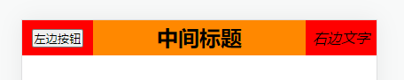
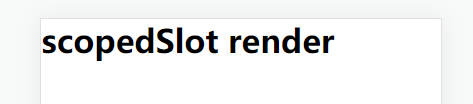

# 插槽意义和实现

- **意义：**让组件具备更强的通用性，组件内容不限制是某种元素，而是由使用组件的人来决定渲染的内容
- **实现：**`Vue` 通过 `<slot>` 标签完成，而 `React` 有以下两种方案实现

# children插槽

- 每个组件都可以获取到 `props.children`，其包含组件的开始标签和结束标签之间的内容
- 首先在父组件的子组件标签中插入内容

```jsx
class App extends Component {
  render() {
    return (
      <div className='app'>
        {/* 父组件中插入内容 */}
        <NavBar>
          <button>左边按钮</button>
          <h2>中间标题</h2>
          <i>右边文字</i>
        </NavBar>
      </div>
    )
  }
}
```

- 然后在子组件内部通过 `this.props.children` 获取，它是个**包含所有插入元素的数组**

```jsx
class NavBar extends Component {
  render() {
    const { children } = this.props
    
    return (
      <div className='nav-bar'>
        <div className="left">{children[0]}</div>
        <div className="center">{children[1]}</div>
        <div className="right">{children[2]}</div>
      </div>
    )
  }
}
```



- **注意：**当子组件标签中**只有一个元素时，`this.props.children` 就是其本身，并非数组**
- 如果需要**限制使用者是传一个元素还是传多个元素**，可以通过 `propTypes` 做类型限制

```javascript
// 子组件标签必须传入多个元素
static propTypes = {
	children: propTypes.array
}

// 子组件标签中只允许有一个元素
static propTypes = {
	children: propTypes.element
}
```

# props插槽

- `props` 除了可以用于组件通信外，还允许直接传递 `React` 元素，用于实现插槽

- 在父组件的子组件标签上将插入内容，按照 `属性名={React元素}` 进行传递

```jsx
class App extends Component {
  render() {
    return (
      <div className='app'>
        {/* 父组件中插入内容 */}
        <NavBar 
          leftSlot={<button>左边按钮</button>}
          centerSlot={<h2>中间标题</h2>}
          rightSlot={<i>右边文字</i>}
        />
      </div>
    )
  }
}
```

- 在子组件内部的 `this.props` 获取传递的内容

```jsx
class NavBar extends Component {
  render() {
    const { leftSlot, centerSlot, rightSlot } = this.props
    return (
      <div className='nav-bar'>
        <div className="left">{leftSlot}</div>
        <div className="center">{centerSlot}</div>
        <div className="right">{rightSlot}</div>
      </div>
    )
  }
}
```

# 作用域插槽

- 在 `Vue` 中的子组件实现插槽之后，可以向外暴露内部的数据，当父组件使用该插槽时就可以拿到对应的数据，这就是 `Vue` 的作用域插槽
- `Vue` 的作用域插槽本质是**将插槽内容包裹在一个拥有单个参数的函数里**，而 `React` 也可以运用这个原理，实现作用域插槽
- 首先在子组件标签中通过 `props` 传入一个返回 `React` 元素的函数

```jsx
class App extends Component {
  render() {
    return (
      <div className='app'>
        <NavBar scopedSlot={(data)=><h1>{data}</h1>}/>
      </div>
    )
  }
}
```

- 在子组件中调用 `scopedSlot` 函数，并传入参数

```jsx
class NavBar extends Component {
  render() {
    const { scopedSlot } = this.props
    return (
      <div className='nav-container'>
        {scopedSlot('scopedSlot render')}
      </div>
    )
  }
}
```


