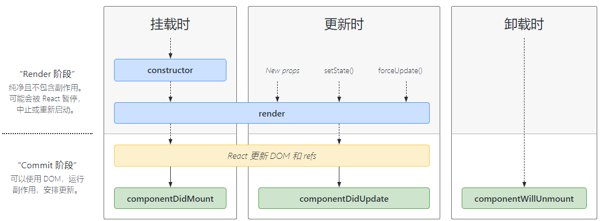
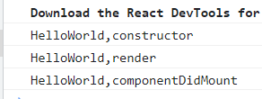
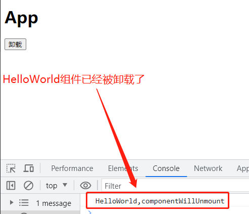
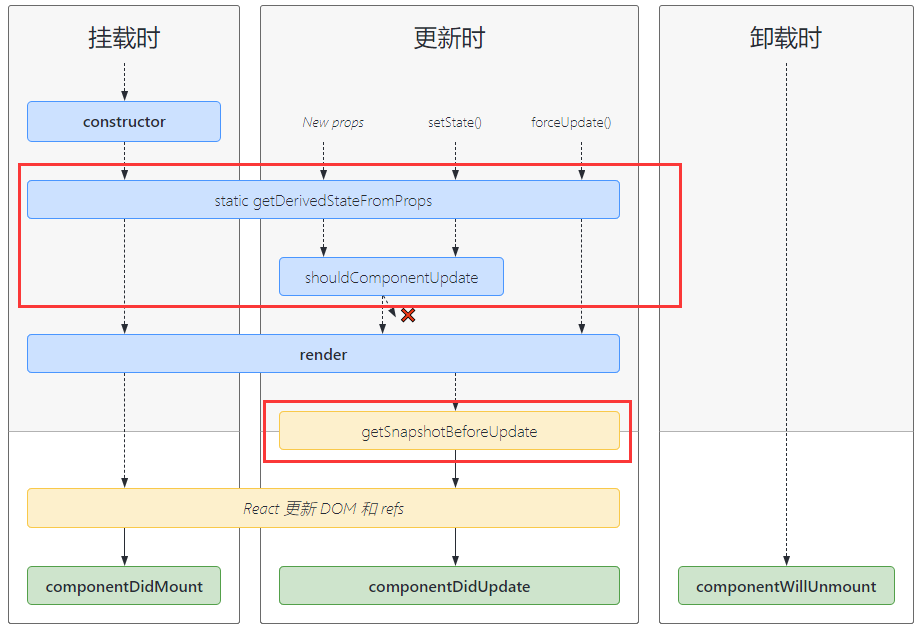

# 生命周期概念

- **生命周期的概念：**事物从创建到销毁的过程
- 生命周期是抽象的概念，是**描述组件从被渲染到被销毁的整个过程**，该过程分为多个阶段：
  - **装载阶段(Mount)：**组件首次在 `DOM` 树中被渲染的过程
  - **更新阶段(Update)：**组件状态发生变化，重新更新渲染的过程
  - **卸载阶段(Unmount)：**组件从 `DOM` 树中被移除的过程

- 生命周期函数是 **`React` 组件内部实现的回调函数**，用于告知该组件当前处于哪个阶段，可在这些回调函数中编写逻辑代码，完成需求功能
  - **`componentDidMount` 函数：**组件已经挂载到 `DOM` 上时就会执行
  - **`componentDidUpdate` 函数：**组件已经发生了更新时就会执行
  - **`componentWillUnmount` 函数：**组件即将被移除时就会执行
- **生命周期示意图：**



# Mount阶段

- 在组件挂载时，首先会执行组件实例中的构造方法，然后执行 `render` 函数，当组件被挂载到页面之后，会执行 `componentDidMount`
  - 依赖于 `DOM` 的操作可以在这里进行
  - 在此处发送网络请求就最好的地方
  - 可以在此处添加一些订阅(会在 `componentWillUnmount` 取消订阅)

```jsx
class HelloWorld extends Component {
  // 1.首先执行构造方法
  constructor(){
    console.log('HelloWorld,constructor');
    super()
    this.state = { }
  }
  // 2.然后执行render函数
  render(){
    console.log('HelloWorld,render');
    return (
      <div>
        <h2>Hello,World</h2>
      </div>
    )
  }

  // 3.组件被挂载
  componentDidMount(){
    console.log('HelloWorld,componentDidMount');
  }
}
```



- **注意：**当写入多个组件标签时，`React` 会创建多个该组件的实例，都会有独自的生命周期

# Update阶段

- 当组件的状态更新后，组件会首先重新执行一遍 `render` 函数，当 `DOM` 更新完成后，然后在执行 `componentDidUpdate` 生命周期函数
  - 首次渲染不会被执行
  - 当组件更新后，可以在此处对 `DOM` 进行操作
  - 如果对更新前后的 `props` 进行比较，也可以在此处进行网络请求

```jsx
class HelloWorld extends Component {
  constructor(){
    super()
    this.state = {
      message:'HelloWorld'
    }
  }

  handleMsgChange(){
    this.setState({
      message:'Hello,React'
    })
  }

  render(){
    console.log('HelloWorld,render');
    const { message } = this.state
    return (
      <div>
        <h2>{message}</h2>
        <button onClick={()=>this.handleMsgChange()}>修改</button>
      </div>
    )
  }

  componentDidUpdate(){
    console.log('HelloWorld,componentDidUpdate');
  }
}
```


# Unmount阶段

- 当组件从页面上被卸载时，会触发 `componentWillUnmount` 生命周期函数
  - 在此方法中执行必要的清理操作
  - 如清除 `timer`，取消网络请求，清除在 `componentDidMount()` 中创建的订阅等

```jsx
{/* App.jsx */}
class App extends Component {
  constructor(){
    super()
    this.state = {
      isShow: true
    }
  }
  render(){
    const { isShow } = this.state
    return (
      <div>
        <h1>App</h1>
        {/* 当点击该按钮触发回调时，HelloWorld组件会执行卸载的生命周期函数 */}
        <button onClick={()=>this.handleUnMount()}>卸载</button>
        {isShow && <HelloWorld />}
      </div>
    )
  }

  handleUnMount(){
    this.setState({
      isShow: !this.state.isShow
    })
  }
}
```



# 其他生命周期函数

- 除了上述的生命周期函数之外，还有以下不常用的生命周期函数



- **`getDerivedStateFromProps`：**`state` 的值在任何时候都依赖于 `props` 时使用，该方法返回一个对象来更新 `state`
- **`getSnapshotBeforeUpdate`：**在 `React` 更新 `DOM` 之前回调的一个函数，可以获取 `DOM` 更新前的一些信息(如滚动位置)，该生命周期函数返回的数据，可以在 `componentDidUpdate` 拿到

```javascript
componentDidUpdate(prevProps, prevState, snapShot)
// prevProps: 更新前的props
// prevState: 更新前的state
// snapShot: 函数返回的数据
```

- **`shouldComponentUpdate`：**该生命周期函数不常用，与性能优化相关，如果在该函数内返回 `false`，则更新后不会重新执行 `render` 函数
