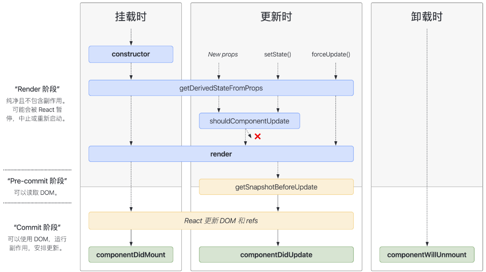

# 生命周期概念

- **生命周期的概念：**事物从创建到销毁的过程，`React` 生命周期是抽象的概念，是**描述组件从被渲染到被销毁的整个过程**

> **`React` 将生命周期分为三个阶段：**

- **装载阶段(Mount)：**组件首次在 `DOM` 树中被渲染的过程
- **更新过程(Update)：**组件状态发生变化，重新更新渲染的过程
- **卸载过程(Unmount)：**组件从 `DOM` 树中被移除的过程

> **生命周期函数**：`React` 组件内部在生命周期的某个节点实现的回调函数，用于告知该组件当前处于哪个阶段，可在这些回调函数中编写逻辑代码

- **`componentDidMount` 函数：**组件已经挂载到 `DOM` 上时就会执行
- **`componentDidUpdate` 函数：**组件已经发生了更新时就会执行
- **`componentWillUnmount` 函数：**组件即将被移除时就会执行

> **生命周期示意图：**



# Mount(挂载)阶段

- 挂载阶段组件被创建，然后组件实例插入到 `DOM` 中，完成组件的首次渲染，该过程只会发生一次

> **挂载阶段会依次调用以下这些方法：**

1. 组件的构造函数 `constructor`
2. `getDerivedStateFromProps` 函数
3. `render` 函数
4. 执行 `componentDidMount`

## constructor

- 第一个被执行，若没有显式定义组件的构造函数，则会有一个默认的构造函数
- 若显式定义了构造函数，则必须在构造函数中执行 `super(props)`，否则无法在构造函数中拿到 `this`

- 如果不初始化 `state` 或不进行方法绑定，则不需要为 `React` 组件实现构造函数

> **`constructor` 通常只做两件事：**

1. 初始化组件状态(`state`)
2. 给事件的处理方法显示绑定 `this`

```javascript
constructor(props) {
  super(props)
  this.state = { 
  	counter: 0
  };
  this.handleClick = this.handleClick.bind(this)
}
```

## getDerivedStateFromProps

- `getDerivedStateFromProps` 是组件实例的静态方法，所以该函数不能使用 `this`

```javascript
static getDerivedStateFromProps(props, state){ };
```

- 该函数有两个参数 --- `props`(接收到的新参数) 和 `state`(当前组件的 `state`)
- 该函数返回一个对象用于更新当前的 `state`，若不需要更新可以返回 `null`

- 该函数在装载时接收到新的 `props`，或调用了 `setState` 和 `forceUpdate` 时会执行

> **应用场景：**当接收到新的属性并想修改 `state`，可以使用该函数

```javascript
// 当props.counter变化时，赋值给state
static getDerivedstateFromProps(props, state) {
  if (props.counter !== state.counter) {
		return { counter: props.counter }
	}
	return null
}
```

## render

- `React` 组件中最核心的方法，组件中必须要有该方法，它根据状态 `state` 和属性 `props` 渲染组件
- `render` 函数只做一件事，就是返回需要渲染的内容，不要在该函数内实现其他逻辑

> **调用该方法可能会返回以下类型：**

- **`React` 元素：**包括原生的 `DOM` 和 `React` 组件
- **数组和 `Fragment`：**可以返回多个元素
- **`Portals`：**可以将子元素渲染到不同的 `DOM` 子树中
- **字符串和数字：**被渲染成 `DOM` 中的 text 节点
- **布尔值或`null`：**不渲染任何内容

```jsx
render(){
  return (
    <div>
      <h2>Hello,World</h2>
    </div>
  )
}
```

## componentDidMount

- `componentDidMount()` 会在组件挂载后(插入 `DOM` 树中)立即执行

> **该函数通常执行以下操作：**

- 依赖于 `DOM` 的操作
- 发送网络请求
- 添加订阅消息(会在 `componentWillUnmount` 取消订阅)

```javascript
componentDidMount() {
	axios.get(...)
}
```

> **注意：**当写入多个组件标签时，`React` 会创建多个该组件的实例，都会有独自的生命周期

# Update(更新)阶段

- 当组件的 `props` 改变了，或组件内部调用了 `setState` / `forceUpdate`，会触发重新渲染，这个过程可能会发生多次

> **这个阶段会依次调用下面这些方法：**

- getDerivedStateFromProps(和挂载阶段一致)
- shouldComponentUpdate函数
- render(和挂载阶段一致)
- getSnapshotBeforeUpdate函数
- componentDidUpdate函数

## shouldComponentUpdate

- 该函数**用于做性能优化**，它是在组件状态更改后，重新渲染开始前触发，默认返回 `true`
- 在组件更新前，可以利用该函数比较新旧 `props` 和 `state` 是否发生变化，然后返回 `true` 或 `false`
- 当返回 `false` 时，组件将不再更新，后续的 `render`、`componentDidupdate` 也不会执行
- 该函数有两个参数 --- `nextProps`(新的 `props`) 和 `nextstate`(新的 `state`)

```javascript
shouldcomponentUpdate(nextProps, nextState) {
  // 判断新旧props和state的状态是否发生改变
  if(nextProps.name === this.props.name || nextState.count === this.state.count) {
    return false;
  }
  return true
}
```

> **注意：**添加 `shouldComponentUpdate` 方法时，不建议使用深度比较，因为效率会很低，可能会比重新渲染组件效率还低，并且该方法维护比较困难，建议会产生明显的性能提升时再使用

## getSnapshotBeforeUpdate

- 该函数**在重新渲染之后**(`render` 之后)，**`DOM` 重新挂载之前**(`componentDidUpdate` 之前)调用
- 该函数有两个参数 --- `prevProps`(更新前的 `props`) 和 `prevState`(更新前的 `state`)，并且必须要和`componentDidUpdate` 配合使用
- 该函数的返回值默认是 `null` ，这个返回值作为第三个参数传给 `componentDidUpdate`

```javascript
getSnapshotBeforeUpdate(prevProps, prevState) {
  return 888; // componentDidUpdate会接收到888
}
```

## componentDidUpdate

- `componentDidUpdate()` 会在更新后会被立即调用，首次渲染不会执行此方法
- 该函数有三个参数 --- `prevProps`(更新前的 `props`)、`prevState`(更新前的 `state`)、`snapShot`( `getSnapshotBeforeUpdate` 函数的返回值)

> **该函数通常执行以下操作：**

- 当组件更新后，对 `DOM` 进行操作
- 如果对更新前后的 `props` 进行比较，也可以在此处进行网络请求

```javascript
componentDidUpdate(prevProps, prevState, snapShot) {}
```

# Unmount(卸载)阶段

- 卸载阶段只有一个生命周期函数 --- `componentWillUnmount()`
- 该函数会在组件卸载及销毁前执行

> **在此方法中执行必要的清理操作：**

- 清除 `timer`，取消网络请求
- 取消在 `componentDidMount()` 中创建的订阅等

```javascript
componentDidMount() {}
```

- 该方法中不应该再使用 `setState`，因为组件一旦被卸载，就不会再挂载和重新渲染

# 废弃的生命周期

- 被废弃的三个函数都在 `render` 之前，因为 `fiber` 架构的出现，很可能因为高优先级任务的出现而打断现有任务，导致这些函数会被执行多次
- 另外 `React` 想约束使用者写出容易维护和扩展的代码

## componentWillMount

- 首先该函数的功能完全可以使用 `componentDidMount` 和 `constructor` 代替，`React` 官方也是推荐发起 `ajax` 请求的时机是`componentDidMount`
- 如果抛开异步获取数据，其余的仅剩初始化，这些功能都可以在 `constructor` 中执行
- 除此之外，如果在 `componentWillMount` 中订阅事件，但服务端渲染并不会执行 `componentWillUnMount` 函数，也就是无法消除订阅的事件，那么服务端会导致内存泄漏
- 有时候难免因为各种各样的情况，导致使用者在 `componentWilMount` 中做一些操作，`React` 为了约束开发者，干脆就废弃了该函数

## componentWillReceiveProps

- 在 `React` 的旧版本中，如果组件自身的某个 `state` 与 `props` 密切相关的话，需要在 `componentWilReceiveProps` 中判断新旧 `props` 是否相同，如果不同再将新 `props` 更新到 `state`
- 这样会破坏 `state` 的单一数据源，导致组件状态变得不可预测，并且增加组件的重绘次数。
- 为了解决问题，`React` 引入一个新的生命周期函数 `getDerivedStateFromProps`

> **`getDerivedStateFromProps` 的优点**

- 该函数是静态方法，不能使用 `this`，可以说是一个纯函数，开发者不能写出副作用的代码
- 只能通过 `prevState` 来做对比，保证 `state` 和 `props` 之间的简单关系，以及不需要处理第一次渲染时`prevProps` 为空的情况
- 将状态变化(setState)和其他操作区分开，更加便于 `render` 和 `commit` 阶段操作

## componentwillUpdate

- 与 `componentWillReceiveProps` 类似，许多开发者也会在 `componentWillUpdate` 中根据 `props` 变化去触发一些回调
- 不论是 `componentWilReceiveProps` 还是 `componentWillUpdate`，都有可能在一次更新中被调用多次，也就是说写在这里的回调函数可能会触发多次
- 与 `componentDidMount` 类似，`componentDidUpdate` 也不存在这样的问题，一次更新中`componentDidUpdate` 只会被调一用次，所以将原先写在 `componentWillUpdate` 中的回调迁移至`componentDidUpdate` 就可以解决多次触发的问题

# 生命周期过程

1. 挂载阶段，首先执行 `constructor` 构造方法来创建组件，初始化组件的 `state` 和 `props`
2. 初始化完成之后就会执行 `render` 方法，该方法会返回需要渲染的内容
3. 随后 `React` 会将需要渲染的内容挂载到 `DOM` 树上
4. 挂载完成后就会执行 `componentDidMount` 生命周期函数
5. 如果给组件创建 `props`(用于组件通信)、调用 `setState`(更改 `state` 中的数据)、调用 `forceUpdate`(强制更新组件)时，都可能重新调用 `render` 函数
6. 在状态更改之后且 `render` 执行之前，会根据 `shouldComponentUpdate` 是否需要重新渲染
7. 若需要重新渲染，则重新执行 `render` 函数，准备重新进行 `DOM` 树的挂载
8. 挂载完成之后就会执行 `componentDidUpdate` 生命周期函数
9. 当移除组件时，就会执行 `componentWillUnmount` 生命周期函数