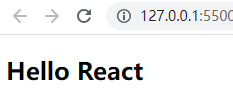

# React简介

> **`React` 基本介绍**

- **概念：**`React` 是<font color='#0c7ca4'>**将数据渲染为 HTML 视图的 JavaScript 库**</font>，用于构建用户界面，由组件组成，拥有自己的逻辑和外观**(官方简介：用于构建 Web 和原生交互界面的库)**
- **作者：**`Facebook` 的软件工程师 `Jordan Walke`
- **官网：**https://zh-hans.react.dev/

> **`React` 三大特点：**声明式、组件化、跨平台

- **声明式编程：**目前整个大前端开发的模式，如 `Vue`、`React`等，允许只需维护自己的状态，当状态改变时，可以根据最新状态渲染 UI 界面
- **组件化开发：**当前前端的流行趋势，将复杂的界面拆分成一个个小组件
- **多平台适配：**2013年`React` 主要是开发 Web 页面；2015 年 `ReactNative` 用于开发移动端跨平台；2017 年 `ReactVR` 用于开发虚拟现实 Web 应用程序

> **`React` 三大开发依赖，各司其职：`react`、`react-dom`、`babel`**

- **`react`：**包含 `react` 所必须的核心代码
- **`react-dom`：**`react` 渲染在不同平台所需的核心代码
- **`babel`：**将JSX转换成 `React` 代码的工具

# React初体验

- 使用 CDN 引入依赖

```html
<script crossorigin src="https://unpkg.com/react@18/umd/react.development.js"></script>
<script crossorigin src="https://unpkg.com/react-dom@18/umd/react-dom.development.js"></script>
<script src="https://unpkg.com/babel-standalone@6/babel.min.js"></script>
```

- 创建一个根元素

```html
<div id="root"></div>
```

- 在浏览器上渲染 Hello React

  - `React18` 前的写法

  ```jsx
  <script type="text/babel"> // 告诉浏览器使用babel转换，否则无法解析
    ReactDOM.render(<h2>Hello React</h2>, document.querySelector('#root'))
  </script>
  ```

  - `React18` 后的写法

  ```jsx
  <script type="text/babel"> // 告诉浏览器使用babel转换，否则无法解析
    const root = ReactDOM.createRoot(document.querySelector('#root'))
    {/* 使用jsx语法，其内部会调用React.createElement方法 */}
    root.render(<h2>Hello React</h2>)
  </script>
  ```

> **JSX语法： `JavaScript XML`，一种在 `React` 组件内部构建标签的类 `XML` 语法，`react` 的语法糖**



- 实现点击按钮，改变文本为 `Hello React,Welcome`

```jsx
const root = ReactDOM.createRoot(document.querySelector('#root')) // 创建根元素

let message = 'Hello React' // 定义所改变的数据

// 将渲染封装成一个函数
const rootRender = () => {
  root.render((
    <div>
      <h2>{message}</h2>
      <button onClick={handleChangeText}>修改文本</button>
    </div>
  ))
}

rootRender() // 初始调用

// 按钮点击函数
const handleChangeText = () => {    
  message = 'Hello React，Welcome'  // 修改数据
  rootRender()   // 手动重新渲染
}
```

> **为什么需要手动重新渲染，而不是自动渲染？**

- `React` 和 `Vue` 不一样，`Vue` 底层实现了依赖收集和数据追踪，状态更改自动重新渲染模板
- `React` 没有这种响应式，所以当状态发生更改时，`React` 无法监听到状态变更
- 这个重新渲染的过程在 `Vue` 中是不可见的，但 `React` 需要手动重新渲染，整个过程是可见的

# 组件化开发

- `root.render` 参数是 HTML 元素或组件，那么可以将之前的逻辑封装到组件中，然后传入到`root.render` 函数中

> **使用类组件进行重构**：

1. **创建组件：**定义一个类，并继承自 `React.Component`，类名须大写(小写则是 `HTML` 元素)

```javascript
class APP extends React.Component {
  constructor() {
    super()
  }  
}
```

2. **实现 `render`：**实现组件的 render 函数，render 函数返回 JSX(渲染的内容)

```jsx
render() {
  return (
    <div>
      <h2>{this.state.message}</h2>
      <button onClick={this.handleChangeText}>修改文本</button>
    </div>
  )
}
```

3. **定义内部状态：**组件的内部状态**定义在构造函数的 state 中**

```javascript
this.state = {  
  message: 'Hello React'
}
```

4. **声明组件方法：**由于底层使用了 `babel` 转换，组件方法中的 this 会转为 `undefined`，事件需要在构造函数中显示绑定 this

```javascript
// 在构造函数中绑定this
this.handleChangeText = this.handleChangeText.bind(this)

handleChangeText() {
  // 调用setState方法更新状态
  this.setState({
    message: 'Hello React，Welcome'
  })
}
```

> **手动调用 `setState` 更新状态的原因：**
>
> - 由于`React` 没有实现响应式，如果通过 `this.state.message = xxx ` 的方式改变状态，则不会自动更新界面
> - 通过调用 `this.setState()` 更新数据，其内部会通知 `React` 进行更新操作，此时会重新调用 `render` 函数，并使用最新数据渲染界面

5. **渲染组件：**创建一个根元素，并在根元素上渲染组件

```jsx
const root = ReactDOM.createRoot(document.querySelector('#root'))
root.render(<APP />)
```

# 小电影列表案例

```jsx
const root = ReactDOM.createRoot(document.querySelector('#root'))

class App extends React.Component {
  constructor() {
    super()
    this.state = {
      movies: ['满江红', '流浪地球2', '无名', '毒舌律师']
    }
  }

  render() {
    return (
      <div>
        <h2>电影列表</h2>
        <ul>
          {this.state.movies.map((movie, i) => <li key={i}>{movie}</li>)}
        </ul>
      </div>
    )
  }
}

root.render(<App />)
```
