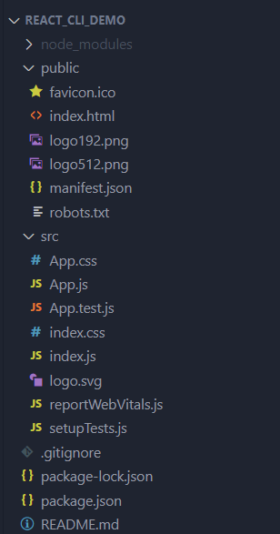
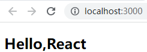

# 项目创建

- 全局安装 `React` 脚手架

```shell
npm i create-react-app -g
```

- 查看 `React` 脚手架版本

```shell
create-react-app --version
```

- 使用脚手架创建 `React` 项目，项目名称不可包含大写字母

```shell
create-react-app react_cli_demo
```

- 进入对应的目录并运行

```shell
# 进入项目根目录
cd react_cli_demo

# 运行项目
npm run start
```

# 项目结构分析



- 项目各个文件的作用

```tcl
react_cli_demo
|-- node_modules # 安装的依赖
|-- public # 存放静态资源
		|-- favicon.ico # 应用程序顶部的icon图标
		|-- index.html # 应用程序的入口文件
		|-- logo192.png # 在manifest.json中使用
		|-- logo512.png # 在manifest.json中使用
		|-- manifest.json # 和Web app配置相关(就算把网页设置成快捷方式，形成桌面图标)
		|-- robots.txt # 指定搜索引擎可以或无法爬取哪些文件
|-- src # 源码存放目录
		|-- App.css # 组件相关的样式
		|-- App.js # 组件的代码文件
		|-- App.test.js # 组件的测试代码文件
		|-- index.css # 全局样式文件
		|-- index.js # 应用程序的入口文件
		|-- logo.svg # 项目的React图标
		|-- reportWebVitals.js # 与网站指标相关内容
		|-- setupTests.js # 测试初始化文件
|-- .gitgnore # git忽略追踪的文件
|-- package-lock.json # 项目真实的依赖信息(较详细)
|-- package.json # 项目所安装的依赖，包括项目版本，依赖版本，浏览器兼容等
|-- README.md # 应用程序的说明文档，包括启动、打包等
```

> - **`PWA`相关概念：**全称 `Progressive Web App`，即渐进式 `WEB` 应用
>   - 一个 `PWA` 应用首先是一个网页，可以通过 `Web` 技术编写出一个网页应用
>   - 随后添加上 `App Manifest` 和 `Service Worker` 来实现 `PWA` 的安装和离线等功能
>   - 这种 `Web` 存在的形式，也称之为是 `Web App`，相当于网页设置成快捷方式形成的桌面图标 `APP`
>   - 只要某个网页**可以被添加到桌面成为快捷方式**，那就是使用了 `PWA` 功能

# 重新搭建项目

- 使用 `React` 脚手架创建的项目中有许多无用的文件，可以将其删掉，如 `src` 下的所有内容，`public` 下只保留入口文件 `index.html` 和图标 `favicon.ico`，删完后结构如下

```tcl
react_cli_demo
|-- node_modules
|-- public
		|-- favicon.ico
		|-- index.html
|-- .gitgnore
|-- package-lock.json
|-- package.json
|-- README.md
```

- 删掉之后重新手动搭建项目
- 首先在 `src` 下新建 `App.jsx`，内容如下

```jsx
import React from "react";

class App extends React.Component {
  constructor(){
    super()
    this.state = {
      message:'Hello,React'
    }
  }
  render(){
    const { message } = this.state
    return (
      <div>
      	<h2>{message}</h2>
      </div>
    )
  }
}

export default App
```

- 然后在 `src` 下新建 `index.js`，内容如下

```javascript
import ReactDOM from "react-dom/client"
import App from './App'

const root = ReactDOM.createRoot(document.getElementById('root'))
root.render(<App />)
```

- 运行项目后，浏览器会渲染 `Hello，React`

